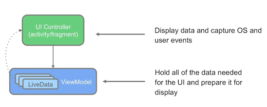
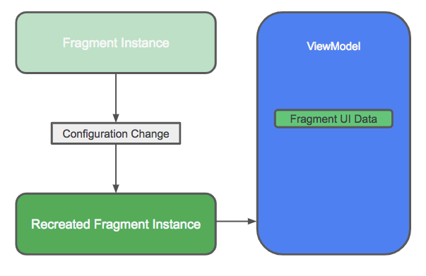
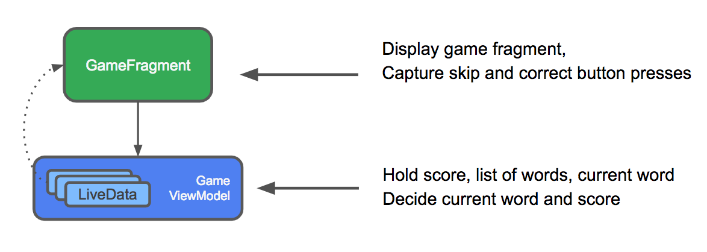
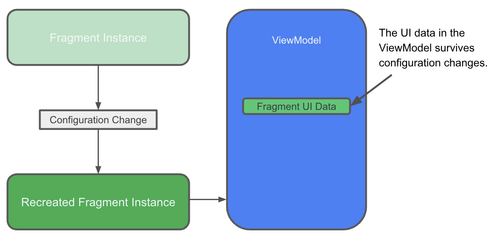
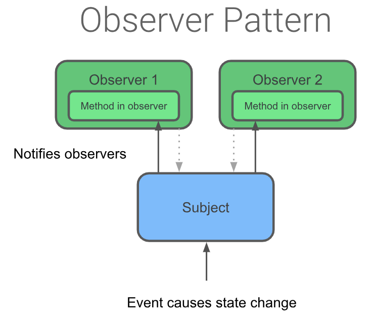
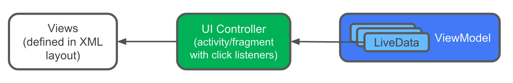
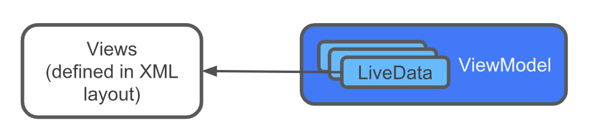

# 1. Android Collab 

This codelab is part of the Android Kotlin Fundamentals course. All the course codelabs are listed on the Android Kotlin Fundamentals codelabs landing page.


- [1. Android Collab](#1-android-collab)
- [2. Data binding basics (databinding app)](#2-data-binding-basics-databinding-app)
  - [2.1. Step 1 Enable data binding](#21-step-1-enable-data-binding)
  - [2.2. Step 2 Changle layout file to be usable with data binding](#22-step-2-changle-layout-file-to-be-usable-with-data-binding)
  - [2.3. Step 3 create a data binding object in the main activity](#23-step-3-create-a-data-binding-object-in-the-main-activity)
  - [2.4. Step 4 use the binding object to replace all calls to the findViewById()](#24-step-4-use-the-binding-object-to-replace-all-calls-to-the-findviewbyid)
  - [2.5. Step 5 create the model](#25-step-5-create-the-model)
  - [2.6. Step 6 add data](#26-step-6-add-data)
    - [2.6.1. Full code](#261-full-code)
- [3. NavigationApp](#3-navigationapp)
    - [3.0.1. Side note](#301-side-note)
  - [3.1. Navigation Component](#31-navigation-component)
    - [3.1.1. Adding a navigation graph to the project](#311-adding-a-navigation-graph-to-the-project)
    - [3.1.2. NavHostFragment](#312-navhostfragment)
    - [3.1.3. Add a click handler to the Play button](#313-add-a-click-handler-to-the-play-button)
    - [3.1.4. Set the pop behavior for the navigation actions](#314-set-the-pop-behavior-for-the-navigation-actions)
      - [3.1.4.1. Up Button in the navbar](#3141-up-button-in-the-navbar)
      - [3.1.4.2. option menu](#3142-option-menu)
    - [3.1.5. Navigation Drawer](#315-navigation-drawer)
  - [3.2. Summary](#32-summary)
- [4. External Activities](#4-external-activities)
  - [4.1. Safe Args dependencies](#41-safe-args-dependencies)
    - [4.1.1. add the code](#411-add-the-code)
    - [4.1.2. add the arguments](#412-add-the-arguments)
    - [4.1.3. Replace Fragment classes with NavDirection classes](#413-replace-fragment-classes-with-navdirection-classes)
  - [4.2. Implicit intents](#42-implicit-intents)
    - [4.2.1. Build and call an implicit intent](#421-build-and-call-an-implicit-intent)
  - [4.3. Summary](#43-summary)
- [5. Lifecycles and logging](#5-lifecycles-and-logging)
  - [5.1. Recap](#51-recap)
  - [5.2. fragmnet lifecycle](#52-fragmnet-lifecycle)
  - [5.3. desert-clicker app](#53-desert-clicker-app)
  - [5.4. Complex lifecycle](#54-complex-lifecycle)
    - [5.4.1. Turn DessertTimer into a LifecycleObserver](#541-turn-desserttimer-into-a-lifecycleobserver)
    - [5.4.2. Modify the MainActivity](#542-modify-the-mainactivity)
  - [5.5. onSaveInstanceState()](#55-onsaveinstancestate)
    - [5.5.1. Use onSaveInstanceState() to save bundle data](#551-use-onsaveinstancestate-to-save-bundle-data)
    - [5.5.2. Use onCreate() to restore bundle data](#552-use-oncreate-to-restore-bundle-data)
  - [5.6. Summary](#56-summary)
- [6. App architecture](#6-app-architecture)
    - [6.0.1. screens/title/TitleFragment.kt](#601-screenstitletitlefragmentkt)
    - [6.0.2. screens/game/GameFragment.kt](#602-screensgamegamefragmentkt)
    - [6.0.3. screens/score/ScoreFragment.kt](#603-screensscorescorefragmentkt)
    - [6.0.4. res/navigation/main_navigation.xml](#604-resnavigationmain_navigationxml)
    - [6.0.5. Issues in the app:](#605-issues-in-the-app)
  - [6.1. recap](#61-recap)
    - [6.1.1. recap safe args](#611-recap-safe-args)
    - [6.1.2. recap binding](#612-recap-binding)
  - [6.2. UI Controller](#62-ui-controller)
  - [6.3. ViewModel](#63-viewmodel)
  - [6.4. ViewModelFactory](#64-viewmodelfactory)
  - [6.5. Create the GameViewModel](#65-create-the-gameviewmodel)
    - [6.5.1. Add the GameViewModel class](#651-add-the-gameviewmodel-class)
    - [6.5.2. Override onClreared()](#652-override-onclreared)
    - [6.5.3. Associate GameViewModel with the game fragment](#653-associate-gameviewmodel-with-the-game-fragment)
    - [6.5.4. init the viewmodel](#654-init-the-viewmodel)
    - [6.5.5. result](#655-result)
  - [6.6. Populate the GameViewModel](#66-populate-the-gameviewmodel)
    - [6.6.1. Move the data fields and data processing to the ViewModel](#661-move-the-data-fields-and-data-processing-to-the-viewmodel)
    - [6.6.2. update references to click handler and data fields in GameFragment](#662-update-references-to-click-handler-and-data-fields-in-gamefragment)
  - [6.7. implement click listerner for the end game button](#67-implement-click-listerner-for-the-end-game-button)
  - [6.8. Use a ViewModelFactory](#68-use-a-viewmodelfactory)
  - [6.9. Summary](#69-summary)
- [7. LiveData and Live Data Observers](#7-livedata-and-live-data-observers)
  - [7.1. LiveData](#71-livedata)
    - [7.1.1. change the score and word to user livedata](#711-change-the-score-and-word-to-user-livedata)
    - [7.1.2. update the LiveData object reference](#712-update-the-livedata-object-reference)
  - [7.2. LiveData Observers](#72-livedata-observers)
  - [7.3. Encapsulate the LiveData](#73-encapsulate-the-livedata)
  - [7.4. Add a backing property](#74-add-a-backing-property)
  - [7.5. adding a game-finished event](#75-adding-a-game-finished-event)
  - [7.6. The observer pattern](#76-the-observer-pattern)
  - [7.7. Use the LiveData to detect a game-finished event](#77-use-the-livedata-to-detect-a-game-finished-event)
  - [7.8. reset the game-finsihed event](#78-reset-the-game-finsihed-event)
  - [7.9. add play again button](#79-add-play-again-button)
  - [7.10. Summary](#710-summary)
    - [7.10.1. LiveData](#7101-livedata)
    - [7.10.2. To add LiveData](#7102-to-add-livedata)
    - [7.10.3. MutableLiveData](#7103-mutablelivedata)
    - [7.10.4. To encapsulate LiveData](#7104-to-encapsulate-livedata)
    - [7.10.5. Observable LiveDat](#7105-observable-livedat)
  - [Code Review](#code-review)
    - [Title Fragment](#title-fragment)
    - [GameFragment](#gamefragment)


# 2. Data binding basics (databinding app)
   
when your app has complex view hierarchies, findViewById() is expensive and slows down the app, because Android traverses the view hierarchy, starting at the root, until it finds the desired view. Fortunately, there's a better way.

Every time you use findViewById() to search for a view after the view is created or recreated, the Android system traverses the view hierarchy at runtime to find it. When your app has only a handful of views, this is not a problem. However, production apps may have dozens of views in a layout, and even with the best design, there will be nested views.

One solution is to create an object that contains a reference to each view. This object, called a Binding object, can be used by your whole app. This technique is called data binding. Once a binding object has been created for your app, you can access the views, and other data, through the binding object, without having to traverse the view hierarchy or search for the data.


Data binding has the following benefit

- code is shorter, easier to read and maintian than code uses findviewbyid()
- data and views are clearly seperated. this benefit of data binding becomes increasiongly imporant 
- the android system only traverses the view hierarchy once to get each view, and happen during app startup not at runtime when the user is interacting with the app\
- you get type safety for accessing (meanes that the compiler validates types while compiling and it throws an error if you try to assign the wrong tupe to a varialble)

## 2.1. Step 1 Enable data binding 

to user data binding you need to enable in gradule file (not enabled by default, cause increases compiling time and may affect app startup time)

Open the build.gradle (Module: app) file.
Inside the android section, before the closing brace, add a buildFeatures section and set dataBinding to true.

    buildFeatures {
        dataBinding true
    }

// it asked me to apply `id 'kotlin-kapt'` in plugins

## 2.2. Step 2 Changle layout file to be usable with data binding 

you need to wrap the xml with `<layout>` tag, this is so that the root calss is no loginger a view group, but instead a layout that contains view vgroups and views

## 2.3. Step 3 create a data binding object in the main activity 

add a reference to the binding objet to the main acitivty si that you cans use it to access views, then import it 

    private lateinit var binding: ActivityMainBinding

Next, you replace the current `setContentView()` function with an instruction that does the following:

- creates the binding object
- uses the `setContentView()` function from the DataBindingUtil class to associate the `activity_main` layout with the `MainActivity` 
- in `onCreate()` replace the `setContentView()` call with the following line of code and import it


    binding = DataBindingUtil.setContentView(this,R.layout.activity_main)


## 2.4. Step 4 use the binding object to replace all calls to the findViewById()

When the binding object is created, the compiler generates the names of the views in the binding object from the IDs of the views in the layout, converting them to camel case
for example the `done_button` is `doneButton` in the binding obejct

    binding.doneButton.setOnClickListener{
        addNickname(it)
    }
    
inside the addNickname

    binding.nicknameText.text = binding.nicknameEdit.text.tostring()
    binding.nicknameEdit.visibility = View.GONE
    binding.doneButton.visibility = View.GONE
    binding.nicknameText.visibility = View.VISIBLE

kotlinze the fiunciotn

    binding.apply {
       nicknameText.text = nicknameEdit.text.toString()
       nicknameEdit.visibility = View.GONE
       doneButton.visibility = View.GONE
       nicknameText.visibility = View.VISIBLE
    }
    
## 2.5. Step 5 create the model 

    data class MyName(var name: String = "", var nickname: String = "")

the data keyword for all model classes (the class will hold data) also the compiler will create extra classes such as equals() and hashcode() and toString()

// not valid here
the @string Rest annotation is not required but we recommend you include it

- the annotation helps the code inspector built into android studio named Lint verify at compile time that usages of the constructor provide a valid string resource ID
- the annotation makes your code more readble for other developer

## 2.6. Step 6 add data

in xml the the name Textview will reference to the name from the data class

between the `<layout>` tags add `<data></data>`

    <data>
        <variable
            name="myName"
            type="com.daniel.androidkotlinfundamentals" />
    </data>
    
inside the Name textview
    
    android:text="@={myName.name}"
    
to add a default text and value

    tools:text="What color is the Android mascot?"
    
    android:text="@={myName.nickname}"

in the main act we add data using the model

    private val myName: MyName = MyName("Aleks Haecky")

and in on create bind the layout variable to the activity class

    binding.myName = myName

for the nickname get the data from the edit text

    myName?.nickname = nicknameEdit.text.toString()

After the nickname is set, you want your code to refresh the UI with the new data. To do this, you must invalidate all binding expressions so that they are recreated with the correct data.

Add `invalidateAll()` after setting the nickname so that the UI is refreshed with the value in the updated binding object.

    binding.apply {
       myName?.nickname = nicknameEdit.text.toString()
       invalidateAll()
       ...
    }

run 

### 2.6.1. Full code

```kotlin
class MainActivity : AppCompatActivity() {
    data class MyName(var name: String = "", var nickname: String = "")
    
    private lateinit var binding: ActivityMainBinding
    private val myName: MyName = MyName("Aleks Haecky")


    override fun onCreate(savedInstanceState: Bundle?) {
        super.onCreate(savedInstanceState)
        binding = DataBindingUtil.setContentView(this,R.layout.activity_main)
        binding.myName = myName

        binding.doneButton.setOnClickListener{
            addNickName(it)
        }
    }

    private fun addNickName(view: View) {
        myName?.nickname = binding.nicknameEdit.text.toString()
        binding.invalidateAll()
        binding.nicknameText.text = binding.nicknameEdit.text.toString()
        binding.nicknameEdit.visibility = View.GONE
        binding.doneButton.visibility = View.GONE
        binding.nicknameText.visibility = View.VISIBLE
    }
}
```

```xml
<?xml version="1.0" encoding="utf-8"?>
<layout xmlns:tools="http://schemas.android.com/tools"
    xmlns:android="http://schemas.android.com/apk/res/android"
    xmlns:app="http://schemas.android.com/apk/res-auto">

    <data>
        <variable
            name="myName"
            type="com.daniel.androidkotlinfundamentals.MyName" />
    </data>

    <androidx.constraintlayout.widget.ConstraintLayout
        android:layout_width="match_parent"
        android:layout_height="match_parent"
        tools:context=".MainActivity">

        <TextView
            android:id="@+id/name_text"
            android:layout_width="wrap_content"
            android:layout_height="wrap_content"
            android:layout_marginBottom="64dp"
            android:text="@={myName.name}"
            app:layout_constraintBottom_toTopOf="@+id/nickname_edit"
            app:layout_constraintEnd_toEndOf="parent"
            app:layout_constraintHorizontal_bias="0.5"
            app:layout_constraintStart_toStartOf="parent" />

        <TextView
            android:id="@+id/nickname_text"
            android:layout_width="wrap_content"
            android:layout_height="wrap_content"
            android:text="@={myName.nickname}"
            app:layout_constraintBottom_toBottomOf="parent"
            app:layout_constraintLeft_toLeftOf="parent"
            app:layout_constraintRight_toRightOf="parent"
            app:layout_constraintTop_toTopOf="parent" />

        <EditText
            android:layout_width="match_parent"
            android:layout_height="wrap_content"
            android:layout_marginBottom="56dp"
            android:id="@+id/nickname_edit"
            app:layout_constraintBottom_toTopOf="@+id/nickname_text"
            app:layout_constraintEnd_toEndOf="parent"
            app:layout_constraintHorizontal_bias="0.0"
            app:layout_constraintStart_toStartOf="parent" />

        <com.google.android.material.button.MaterialButton
            android:layout_width="wrap_content"
            android:layout_height="wrap_content"
            android:text="3i3i"
            android:id="@+id/done_button"
            app:layout_constraintBottom_toBottomOf="parent"
            app:layout_constraintEnd_toEndOf="parent"
            app:layout_constraintStart_toStartOf="parent"
            app:layout_constraintTop_toBottomOf="@+id/nickname_text" />
    </androidx.constraintlayout.widget.ConstraintLayout>
</layout>

```

# 3. NavigationApp

Base code provided form the google collab

in fragment binding the layout to the fragment and inflate it using (in the onCreateView())

    // inflate the layout
    val binding = DataBindingUtil.inflate<FragmentGameBinding>(
        inflater, R.layout.fragment_game, container, false
    )
    
    //bind this fragment class to the layout (data variable)
    binding.game = this
    
    return binding.root
    
-inflater, which is the LayoutInflater used to inflate the binding layout.
-The XML layout resource of the layout to inflate. Use one of the layouts that is already defined for you, R.layout.fragment_title.
-container for the parent ViewGroup. (This parameter is optional.)
-false for the attachToParent value.
-Assign the binding that DataBindingUtil.inflate returns to the binding variable.
-Return binding.root from the method, which contains the inflated view. Your onCreateView() method now looks like the following code:

### 3.0.1. Side note

in activity
   
    binding = DataBindingUtil.setContentView(this,R.layout.activity_main)

    binding.myName = myName
    
in radio group 
    
    val checkedId = binding.questionRadioGroup.checkedRadioButtonId
    // Do nothing if nothing is checked (id == -1)
    if (-1 != checkedId) {


## 3.1. Navigation Component
is a lib that can manage complex naviagation deeplinking and compile time 

in project build.gradle 

    ext {
            navigationVersion = "2.3.0"
            kotlin_version = "1.4.30"
        }

in app build gradle
    
    dependencies {
      ...
      implementation "androidx.navigation:navigation-fragment-ktx:$navigationVersion"
      implementation "androidx.navigation:navigation-ui-ktx:$navigationVersion"
      ...
    }
    
### 3.1.1. Adding a navigation graph to the project
In the Project: Android pane, right-click the res folder and select New > Android Resource File.
In the New Resource File dialog, select Navigation as the Resource type.
In the File name field, name the file navigation.
Make sure the Chosen qualifiers box is empty, and click OK. A new file, navigation.xml, appears in the res > navigation folder.
Open the res > navigation > navigation.xml file and click the Design tab to open the Navigation Editor. Notice the No NavHostFragments found message in the layout editor


### 3.1.2. NavHostFragment
a navigation host fragment acts as a host for the framgnets ina a navigation graph. The naviagation host fragment ius usually named NavHostFragment

As the user moves between destinations defined in the navigation graph, the navigation host Fragment swaps fragments in and out as necessary. The Fragment also creates and manages the appropriate Fragment back stack.

in the `activity_main.xml` add `androidx.navigation.fragment.NavHostFragment`
-add ID
-The navigation host Fragment needs to know which navigation graph resource to use. Add the app:navGraph attribute and set it to the navigation graph resource, which is @navigation/navigation.
-Add the app:defaultNavHost attribute and set it to "true". Now this navigation host is the default host and will intercept the system Back button.
     
       <fragment
            android:id="@+id/myNavHostFragment"
            android:name="androidx.navigation.fragment.NavHostFragment"
            android:layout_width="match_parent"
            android:layout_height="match_parent"
            app:navGraph="@navigation/navigation"
            app:defaultNavHost="true" />


Open navigation.xml from the navigation resource folder. In the Navigation Editor, click the New


Select fragment_title. You add fragment_title first because the TitleFragment Fragment is where app

If the preview shows a "Preview Unavailable" message, click the Code tab to open the navigation XML. Make sure that the fragment element for the gameFragment includes tools:layout="@layout/fragment_game", as shown below.
    
    <fragment
       android:id="@+id/gameFragment"
       android:name="com.example.android.navigation.GameFragment"
       android:label="GameFragment"
       tools:layout="@layout/fragment_game" />

In the layout editor (using the Design view), drag the game Fragment to the right so it doesn't overlap with the title Fragment.

n the preview, hold the pointer over the title Fragment. A circular connection point appears on the right side of the Fragment view. Click the connection point and drag it to the gameFragment or drag it to anywhere in the gameFragment preview. An Action is created that connects the two fragments.
To see the Action's attributes, click the arrow that connects the two fragments. In the Attributes pane, check that the action's ID is set to action_titleFragment_to_gameFragment.


### 3.1.3. Add a click handler to the Play button

In Android Studio, open the TitleFragment.kt file. Inside the onCreateView() method, add the following code before the return statement:

    binding.playButton.setOnClickListener { view : View ->
           view.findNavController().navigate(R.id.action_titleFragment_to_gameFragment)
    }
    
in **fragment** 

    // We've won!  Navigate to the gameWonFragment.
    view.findNavController()
       .navigate(R.id.action_gameFragment_to_gameWonFragment)
    
### 3.1.4. Set the pop behavior for the navigation actions
   
The Android system's Back button is shown as 1 in the screenshot above. If the user presses the Back button in the game-won fragment or the game-over Fragment, the app navigates to the question screen. Ideally, the Back button should navigate back to the app's title screen. You change the destination for the Back button in the next task.

Until now, you've let the navigation controller handle the back stack for you. When the user navigates to a destination in your app, Android adds this destination to the back stack.

In this step, you manage the back stack so that when the user is at the GameWon or GameOver screen, pressing the Back button returns them to the title screen. You manage the back stack by setting the "pop" behavior for the actions that connect the fragments:

- the `popUpTo` attribute of an action " pops up" the back stack to a given destination before navigation (destinations are removed from the backstack)
- if the `popUpToInclusive` attribute is false or is not set, `popUpTo` removes destinations up ot specifed destination but leaves the specified desticnation in the back stac
- if `popUpToInclusive` is set to `true` the popUpTo attribute remives all destinations up to and including the back stact
- If `popUpToInclusive` is true and popUpTo is set to the app's starting location, the action removes all app destinations from the back stack. The Back button takes the user all the way out of the app

in this set you set the popUpTo for the 2 action using Pop To 

* Select the action for navigating from the gameFragment to the gameOverFragment. (In the preview area, the action is represented by a blue line that connects the two fragments.)
* In the Attributes pane, set popUpTo to gameFragment. Select the popUpToInclusive checkbox.


This sets the popUpTo and popUpToInclusive attributes in the XML. The attributes tell the navigation component to remove fragments from the back stack up to and including GameFragment. (This has the same effect as setting the popUpTo field to titleFragment and clearing the popUpToInclusive checkbox.)

and again for the gameWonFragment

to create a user flow when trying again in gameOverFragment create a flow to gameFragment

in the attrbutes pane set the actions popUpTo to title fragment, and clear the popUpToInclusive checkbox, because you do not want the titleFragment to be included in the destination that are removed, 
we want everything up to the titleFragment (but not including it) to be removed from the back stack
same for the gameWon

#### 3.1.4.1. Up Button in the navbar

Open the MainActivity.kt kotlin file. Inside the onCreate() method, add code to find the navigation controller object:

    val navController = this.findNavController(R.id.myNavHostFragment)
Also inside the onCreate() method, add code to link the navigation controller to the app bar:

    NavigationUI.setupActionBarWithNavController(this,navController)
After the onCreate() method, override the onSupportNavigateUp() method to call navigateUp() in the navigation controller:

    override fun onSupportNavigateUp(): Boolean {
            val navController = this.findNavController(R.id.myNavHostFragment)
            return navController.navigateUp()
        }

#### 3.1.4.2. option menu
in navigation add the about fragment.

Add the options-menu resource
In the Android Studio Project pane, right-click the res folder and select New > Android Resource File.
In the New Resource File dialog, name the file options_menu.
Select Menu as the Resource type and click OK


Open the options_menu.xml file from the res > menu folder and click the Design tab to see the Layout Editor.
From the Palette pane, drag a Menu Item (shown as 1 in the screenshot below) and drop it anywhere in the design editor pane (2). A menu item appears in the preview (3) and in the Component Tree (4).

>Tip: Make sure that the ID of the menu item that you just added is exactly the same as the ID of the AboutFragment that you added in the navigation graph. This will make the code for the onClick handler much simpler.

Open the TitleFragment.kt Kotlin file. Inside the onCreateView() method, before the return, call the setHasOptionsMenu() method and pass in true.
After the onCreateView() method, override the onCreateOptionsMenu() method. In the method, add the options menu and inflate the menu resource file.

    override fun onCreateOptionsMenu(menu: Menu, inflater: MenuInflater) {
            super.onCreateOptionsMenu(menu, inflater)
            inflater.inflate(R.menu.options_menu, menu)
    }
    
Override the onOptionsItemSelected() method to take the appropriate action when the menu item is tapped. In this case, the action is to navigate to the Fragment that has the same id as the selected menu item.
    
    override fun onOptionsItemSelected(item: MenuItem): Boolean {
         return NavigationUI.
                onNavDestinationSelected(item,requireView().findNavController())
                || super.onOptionsItemSelected(item)
    }

### 3.1.5. Navigation Drawer
    
To create a navigation drawer, you create the navigation menu. You also need to put your views inside a DrawerLayout in the layout file.

>Note: If you use the same ID for the menu item as for the destination Fragment, you don't need to write any code at all to implement the onClick listener!

Wrap the entire <LinearLayout> inside a <DrawerLayout>. in main activity xml

    <layout xmlns:android="http://schemas.android.com/apk/res/android"
       xmlns:app="http://schemas.android.com/apk/res-auto">
       <androidx.drawerlayout.widget.DrawerLayout
           android:id="@+id/drawerLayout"
           android:layout_width="match_parent"
           android:layout_height="match_parent">
    
       <LinearLayout
           . . . 
           </LinearLayout>
       </androidx.drawerlayout.widget.DrawerLayout>
    </layout>

Now add the drawer, which is a NavigationView that uses the navdrawer_menu that you just defined. Add the following code in the DrawerLayout, after the </LinearLayout> element:

    <com.google.android.material.navigation.NavigationView
       android:id="@+id/navView"
       android:layout_width="wrap_content"
       android:layout_height="match_parent"
       android:layout_gravity="start"
       app:headerLayout="@layout/nav_header"
       app:menu="@menu/navdrawer_menu" />
       
Display the navigation drawer
You created the menu items for the navigation drawer and the navigation drawer layout. Now you need to connect the navigation drawer to the navigation controller so that when users select items in the navigation drawer, the app navigates to the appropriate Fragment.
Open the Mainactivity.kt Kotlin file. In onCreate(), add the code that allows the user to display the navigation drawer. Do this by calling setupWithNavController(). Add the following code at the bottom of onCreate():
    
    NavigationUI.setupWithNavController(binding.navView, navController)

    
Display the navigation drawer from the drawer button
The final step is to enable the user to access the navigation drawer from the drawer button at the top left of the app bar.

In the Mainactivity.kt Kotlin file, add the lateinit drawerLayout member variable to represent the drawer layout:

    private lateinit var drawerLayout: DrawerLayout

Inside the onCreate() method, initialize drawerLayout after the binding variable has been initialized.

    val binding = DataBindingUtil.setContentView<ActivityMainBinding>(this,
                    R.layout.activity_main)
    
    drawerLayout = binding.drawerLayout
Add the drawerLayout as the third parameter to the setupActionBarWithNavController() method:
    
    NavigationUI.setupActionBarWithNavController(this, navController, drawerLayout)
Edit the onSupportNavigateUp() method to return NavigationUI.navigateUp instead of returning navController.navigateUp. Pass the navigation controller and the drawer layout to navigateUp(). The method will look like as follows:

    override fun onSupportNavigateUp(): Boolean {
       val navController = this.findNavController(R.id.myNavHostFragment)
       return NavigationUI.navigateUp(navController, drawerLayout)
    }
    
## 3.2. Summary
To use the Android navigation library, you need to do some setup:

- Add dependencies for navigation-fragment-ktx and navigation-ui-ktx in the module-level build.gradle file.
- Add an ext variable for the navigationVersion in the project-level build.gradle file.

Navigation destinations are fragments, activities, or other app components that the user navigates to. A navigation graph defines the possible paths from one navigation destination to the next.

-To create a navigation graph, create a new Android resource file of type Navigation. This file defines the navigation flow through the app. The file is in the res/navigation folder, and it's typically called navigation.xml.
-To see the navigation graph in the Navigation Editor, open the navigation.xml file and click the Design tab.
-Use the Navigation Editor to add destinations such as fragments to the navigation graph.
-To define the path from one destination to another, use the Navigation Graph to create an action that connects the destinations. In the navigation.xml file, each of these connections is represented as an action that has an ID.

a navigation host fragment usually named NavHostFragment acts as a host for framgents in the navigation graph

- as the user moves between destinations deffined in the navgation graph the `navhostfrgament`swaps the the fragments in and out oand manages the fragment backstack
- in the activity_main.xml layout file the `NavHostFragment` is represented be a fragment element with name `android:name="androidx.navigation.fragment.NavHostFragment"`

to define which fragment is displayed when the user taps a view for example a buitton. set on the onClick listener for the view call

    findNavController().navigate()
    
specify the id of the action

Conditional navigation navigates to one screen in one case, and to a different screen in another case. to create conditional navigation:

- use the navigation editor to create a connection from the starting fragment to each of the possible destination fragments
- give each connection a unique ID
- in the click listener method for the View, add code to detect the condition then call the findNavController().navigate() on the view, passing in the ID for the appropriate action.


The back button

- in the navigation editor, you can use the attributes pane to change the action's `popUpTo` setting. this setting remives destinations from the back stack whihc have the effect of determining where the back button takes the user
- the `popUpTo` setting apprears as the `popUpTo` attribute in the `navigation.xml`
- selecting the `popUpToInclusive` checkbox sets the attribute to true > all destinations up to and including this destination are removed form the backstack


if the action popUpTo attrubte is set to apps starting destination and inclusive is set to tryuue the backbutton takes the user out of the app

The Up Button
The navigation controller's NavigationUI library integrates with the app bar to allow the user to tap the Up button on the app bar to get back to the app's home screen from anywhere in the app.

To link the navigation controller to the app bar:

    val navController = this.findNavController(R.id.myNavHostFragment)
    NavigationUI.setupActionBarWithNavController(this,navController)

Override the onSupportNavigateUp() method to call navigateUp() in the navigation controller:

    override fun onSupportNavigateUp(): Boolean {
            val navController = this.findNavController(R.id.myNavHostFragment)
            return navController.navigateUp()
        }
    }

The options menu

The options menu is a menu that the user accesses from the app bar by tapping the icon with the three vertical dots 4cdd17fa43bfbe6.png. To create an options menu with a menu item that displays a Fragment, make sure the Fragment has an ID. Then define the options menu and code the onOptionsItemSelected() handler for the menu items.

    override fun onCreateOptionsMenu(menu: Menu, inflater: MenuInflater) {
            super.onCreateOptionsMenu(menu, inflater)
            inflater.inflate(R.menu.options_menu, menu)
    }

Override the onOptionsItemSelected() method to take the appropriate action when the menu item is clicked. The following code displays the Fragment that has the same ID as the menu item. (This code only works if the menu item and the Fragment have identical ID values.)


    override fun onOptionsItemSelected(item: MenuItem): Boolean {
         return NavigationUI.
                onNavDestinationSelected(item,requireView().findNavController())
                || super.onOptionsItemSelected(item)
    }

Navigation drawer

Add dependencies to build.gradle:
The navigation drawer is part of the Material Components for Android library. Add the Material library to the build.gradle (app) file:


    dependencies {
        ...
        implementation "com.google.android.material:material:$supportlibVersion"
        ...
    }

Give each destination Fragment an ID:
If a Fragment is reachable from the navigation drawer, open it in the navigation graph to make sure that it has an ID.
Create the menu for the drawer:
Create an Android resource file of type Menu (typically called navdrawer_menu) for a navigation drawer menu. This creates a new navdrawer_menu.xml file in the Res > Menu folder.
In the design editor, add Menu Item widgets to the Menu.
Add the drawer to the layout for the Fragment:
In the layout that contains the navigation host Fragment (which is typically the main layout), use <androidx.drawerlayout.widget.DrawerLayout> as the root view.
Add a <com.google.android.material.navigation.NavigationView> view to the layout.
Connect the drawer to the navigation controller:
Open the Activity that creates the navigation controller. (The main Activity is typically the one you want here.) In onCreate(), use NavigationUI.setupWithNavController()to connect the navigation drawer with the navigation controller:

    val binding = DataBindingUtil.setContentView<ActivityMainBinding>(
           this, R.layout.activity_main)
    NavigationUI.setupWithNavController(binding.navView, navController)

Set up the drawer button in the app bar:
In onCreate() in the Activity that creates the navigation controller (which is typically the main Activity), pass the drawer layout as the third parameter to NavigationUI.setupActionBarWithNavController
val binding = DataBindingUtil.setContentView<ActivityMainBinding>(
    this, R.layout.activity_main)

    NavigationUI.setupActionBarWithNavController(
        this, navController, binding.drawerLayout)
To make the Up button work with the drawer button, edit onSupportNavigateUp() to return NavigationUI.navigateUp(). Pass the navigation controller and the drawer layout to navigateUp().

    override fun onSupportNavigateUp(): Boolean {
       val navController = this.findNavController(R.id.myNavHostFragment)
       return NavigationUI.navigateUp(navController, drawerLayout)
    }

# 4. External Activities

Before users can share their game results from within the AndroidTrivia app, your code needs to pass parameters from one Fragment to another. To prevent bugs in these transactions and make them type-safe, you use a Gradle plugin called Safe Args. The plugin generates NavDirection classes, and you add these classes to your code.

Your app could use a Bundle to pass data from Fragment A to Fragment B. For example, Fragment A creates a bundle and saves the information as key-value pairs, then passes the Bundle to Fragment B. Then Fragment B uses a key to fetch a key-value pair from the Bundle. This technique works, but it can result in code that compiles, but then has the potential to cause errors when the app runs.

The kinds of errors that can occur are:

- Type mismatch errors. For example, if Fragment A sends a string but Fragment B requests an integer from the bundle, the request returns the default value of zero. Since zero is a valid value, this kind of type mismatch problem does not throw an error when the app is compiled. However, when the user runs the app, the error might make the app misbehave or crash.
- Missing key errors. If Fragment B requests an argument that isn't set in the bundle, the operation returns null. Again, this doesn't throw an error when the app is compiled but could cause severe problems when the user runs the app.
You want to catch these errors when you compile the app in Android Studio, so that you catch these errors before deploying the app into production. In other words, you want to catch the errors during app development so that your users don't encounter them.
 
## 4.1. Safe Args dependencies  
    
    // Adding the safe-args dependency to the project Gradle file
    dependencies {
       ...
    classpath "androidx.navigation:navigation-safe-args-gradle-plugin:$navigationVersion"
    
    }

Open the app-level build.gradle file.
At the top of the file, after all the other plugins, add the apply plugin statement with the androidx.navigation.safeargs plugin:

    apply plugin: 'androidx.navigation.safeargs'

The app project now includes generated NavDirection classes.

The Safe Args plugin generates a NavDirection class for each Fragment. These classes represent navigation from all the app's actions.

For example, GameFragment now has a generated GameFragmentDirections class. You use the GameFragmentDirections class to pass type-safe arguments between the game Fragment and other fragments in the app.

To see the generated files, explore the generatedJava folder in the Project > Android pane.

>Caution: Do not edit the NavDirection classes. These classes are regenerated whenever the project is compiled, and your edits will be lost

Add a NavDirection class to the game Fragment

Open the GameFragment.kt Kotlin file that's in the java folder.
Inside the onCreateView() method, locate the game-won conditional statement ("We've won!"). Change the parameter that's passed into the NavController.navigate() method: Replace the action ID for the game-won state with an ID that uses the actionGameFragmentToGameWonFragment() method from the GameFragmentDirections class.

### 4.1.1. add the code

    view.findNavController()
            .navigate(GameFragmentDirections.actionGameFragmentToGameOverFragment())
            

// Using directions to navigate to the GameWonFragment
    
    view.findNavController()
        .navigate(GameFragmentDirections.actionGameFragmentToGameWonFragment())

we add arguments to the gameWonFragment and pass the argumnets safelly into a GameFragmentDirections method. similarly you then will replace the other Fragment classes with their equivialent NavDirection classes

### 4.1.2. add the arguments
Open the navigation.xml file, which is in the res > navigation folder. Click the Design tab to open the navigation graph, which is where you'll set the arguments in the fragments.
In the preview, select the `gameWonFragment`.
In the Attributes pane, expand the Arguments section.
Click the + icon to add an argument. Name the argument numQuestions and set the type to Integer, then click Add. This argument represents the number of questions the user answered.

If you try to build the app now, you will likely get two compile errors.


No value passed for parameter 'numQuestions'
No value passed for parameter 'numCorrect'

to pass 

    // Adding the parameters to the Action
    view.findNavController()
          .navigate(GameFragmentDirections
                .actionGameFragmentToGameWonFragment(numQuestions, questionIndex))

to receive in gamewontfragment

    val args = GameWonFragmentArgs.fromBundle(requireArguments())
    Toast.makeText(context, "NumCorrect: ${args.numCorrect}, NumQuestions: ${args.numQuestions}", Toast.LENGTH_LONG).show()

### 4.1.3. Replace Fragment classes with NavDirection classes

When you use "safe arguments," you can replace Fragment classes that are used in navigation code with NavDirection classes. You do this so that you can use type-safe arguments with other fragments in the app.

in TitleFragment

previously
            
                view.findNavController().navigate(R.id.action_titleFragment_to_gameFragment)

now 

                view.findNavController().navigate(TitleFragmentDirections.actionTitleFragmentToGameFragment())

same for GameOverFragment.kt 

        .navigate(GameOverFragmentDirections.actionGameOverFragmentToGameFragment())


## 4.2. Implicit intents
An Intent is a simple message object that's used to communicate between Android components. There are two types of intents: explicit and implicit. You can send a message to a specific target using an explicit intent. With an implicit intent, you initiate an Activity without knowing which app or Activity will handle the task. For example, if you want your app to take a photo, you typically don't care which app or Activity performs the task. When multiple Android apps can handle the same implicit intent, Android shows the user a chooser, so that the user can select an app to handle the request.

Each implicit intent must have an ACTION that describes the type of thing that is to be done. Common actions, such as ACTION_VIEW, ACTION_EDIT, and ACTION_DIAL, are defined in the Intent class.

Add an options menu to the Congratulations screen
Open the GameWonFragment.kt Kotlin file.
Inside the onCreateView() method, before the return, call the setHasOptionsMenu() method and pass in true:

    setHasOptionsMenu(true)

### 4.2.1. Build and call an implicit intent
Modify your code to build and call an Intent that sends the message about the user's game data. Because several different apps can handle an ACTION_SEND intent, the user will see a chooser that lets them select how they want to send their information.

    // Creating our Share Intent
    private fun getShareIntent() : Intent {
       val args = GameWonFragmentArgs.fromBundle(requireArguments())
       val shareIntent = Intent(Intent.ACTION_SEND)
       shareIntent.setType("text/plain")
                .putExtra(Intent.EXTRA_TEXT, getString(R.string.share_success_text, args.numCorrect, args.numQuestions))
       return shareIntent
    }
    
    // Starting an Activity with our new Intent
    private fun shareSuccess() {
       startActivity(getShareIntent())
    }
    
    
    // Showing the Share Menu Item Dynamically
    override fun onCreateOptionsMenu(menu: Menu, inflater: MenuInflater) {
           super.onCreateOptionsMenu(menu, inflater)
           inflater.inflate(R.menu.winner_menu, menu)
           if(getShareIntent().resolveActivity(requireActivity().packageManager)==null){
                menu.findItem(R.id.share).isVisible = false
           }
    }

 If the result equals null, which means that the shareIntent doesn't resolve, find the sharing menu item from the inflated menu and make the menu item invisible.
 
     // Sharing from the Menu
     override fun onOptionsItemSelected(item: MenuItem): Boolean {
             when(item.itemId){
                 R.id.share -> shareSuccess()
             }
             return super.onOptionsItemSelected(item)
     }

## 4.3. Summary

Safe args:

- to help catch error by missing or mismatched types whenj u pass data from 1 frag to another
- each frag the safe arg plugin generate a corresponding `navdirection` class. you add the `navdirection` to the fragmnet code 
- the `NavDirection` classes represent navigation from all the app's actions

add the plugins 

in the fragments we can use 

    view.findNavController().navigate(GameFragmentDirections.actionGameFragmentToGameOverFragment())

previously 

    view.findNavController().navigate(R.id.action_titleFragment_to_gameFragment)
        
passing data between fragments using safe args

Open the navigation.xml file, which is in the res > navigation folder. Click the Design tab to open the navigation graph, which is where you'll set the arguments in the fragments.
In the preview, select the `gameWonFragment`.
In the Attributes pane, expand the Arguments section.
Click the + icon to add an argument. Name the argument numQuestions and set the type to Integer, then click Add. This argument represents the number of questions the user answered.

If you try to build the app now, you will likely get two compile errors.


No value passed for parameter 'numQuestions'
No value passed for parameter 'numCorrect'

to pass 

    // Adding the parameters to the Action
    view.findNavController()
          .navigate(GameFragmentDirections
                .actionGameFragmentToGameWonFragment(numQuestions, questionIndex))

to receive in gamewontfragment

    val args = GameWonFragmentArgs.fromBundle(requireArguments())
    Toast.makeText(context, "NumCorrect: ${args.numCorrect}, NumQuestions: ${args.numQuestions}", Toast.LENGTH_LONG).show()


Implicient intent
An implicit intent declares an action that your app wants some other app (such as a camera app or email app) to perform on its behalf.
If several Android apps could handle an implicit intent, Android shows the user a chooser. For example, when the user taps the share icon in the AndroidTrivia app, the user can select which app they want to use to share their game results.
To build an intent, you declare an action to perform, for example ACTION_SEND.
Several Intent() constructors are available to help you build intents.

Sharing functionality:

In the case of sharing your success with your friends, the Intent action would be Intent.ACTION_SEND.
To add an options menu to a Fragment, set the setHasOptionsMenu() method to true in the Fragment code.
In the Fragment code, override the onCreateOptionsMenu() method to inflate the menu.
Override the onOptionsItemSelected() to use startActivity() to send the Intent to other apps that can handle it.
When the user taps the menu item, the intent is fired, and the user sees a chooser for the SEND action.

# 5. Lifecycles and logging

In this codelab, you learn about a fundamental part of Android: the activity and fragment lifecycle. The activity lifecycle is the set of states an activity can be in during its lifetime. The lifecycle extends from when the activity is initially created to when it is destroyed and the system reclaims that activity's resources. As a user navigates between activities in your app (and into and out of your app), those activities each transition between different states in the activity lifecycle.


Often, you want to change some behavior, or run some code when the activity lifecycle state changes. Therefore the Activity class itself, and any subclasses of Activity such as AppCompatActivity, implement a set of lifecycle callback methods. Android invokes these callbacks when the activity moves from one state to another, and you can override those methods in your own activities to perform tasks in response to those lifecycle state changes. The following diagram shows the lifecycle states along with the available overridable callbacks.


A fragment also has a lifecycle. A fragment's lifecycle is similar to an activity's lifecycle, so a lot of what you learn applies to both


## 5.1. Recap

binding


    // Contains all the views
    private lateinit var binding: ActivityMainBinding
    
in on create()

    // Use Data Binding to get reference to the views
    binding = DataBindingUtil.setContentView(this, R.layout.activity_main)

    binding.dessertButton.setOnClickListener {
        onDessertClicked()
    }
    
in xml

    
    <layout xmlns:android="http://schemas.android.com/apk/res/android"
        xmlns:app="http://schemas.android.com/apk/res-auto"
        xmlns:tools="http://schemas.android.com/tools">

    <data>

        <variable
            name="revenue"
            type="Integer" />

        <variable
            name="amountSold"
            type="Integer" />
    </data>
    
    ...    
    android:text="@{amountSold.toString()}"

>Note: The onCreate() method is an override. If you override any lifecycle methods, you must immediately call super.onCreate().

Adding timber for debugging

    implementation 'com.jakewharton.timber:timber:4.7.1'

In this step, you create an Application class. Application is a base class that contains global application state for your entire app. It's also the main object that the operating system uses to interact with your app. There is a default Application class that Android uses if you don't specify one, so there's always an Application object created for your app, without you needing to do anything special to create it.

Timber uses the Application class because the whole app will be using this logging library, and the library needs to be initialized once, before everything else is set up. In cases like this, you can subclass the Application class and override the defaults with your own custom implementation.

>Warning: It might be tempting to add your own code to the Application class, because the class is created before all of your activities and can hold global state. But just as it's error-prone to make readable and writable static variables that are globally available, it's easy to abuse the Application class. Avoid putting any activity code in the Application class unless the code is really needed.
    
    override fun onResume() {
       super.onResume()
       Timber.i("onResume Called")
    }

When your app is in the background, it should not be actively running, to preserve system resources and battery life. You use the Activity lifecycle and its callbacks to know when your app is moving to the background so that you can pause any ongoing operations. Then you restart those operations when your app comes into the foreground.

## 5.2. fragmnet lifecycle
    
    override fun onAttach(context: Context) {
       super.onAttach(context)
       Log.i("TitleFragment", "onAttach called")
    }
    override fun onCreate(savedInstanceState: Bundle?) {
       super.onCreate(savedInstanceState)
       Log.i("TitleFragment", "onCreate called")
    }
    
    override fun onViewCreated(view: View, savedInstanceState: Bundle?) {
        super.onViewCreated(view, savedInstanceState)
        Log.i("TitleFragment", "onViewCreated called")
    }
    
    override fun onStart() {
       super.onStart()
       Log.i("TitleFragment", "onStart called")
    }
    override fun onResume() {
       super.onResume()
       Log.i("TitleFragment", "onResume called")
    }
    override fun onPause() {
       super.onPause()
       Log.i("TitleFragment", "onPause called")
    }
    override fun onStop() {
       super.onStop()
       Log.i("TitleFragment", "onStop called")
    }
    override fun onDestroyView() {
       super.onDestroyView()
       Log.i("TitleFragment", "onDestroyView called")
    }
    override fun onDetach() {
       super.onDetach()
       Log.i("TitleFragment", "onDetach called")
    }


Here you can see the entire startup lifecycle of the fragment, including these callbacks:

- onAttach(): Called when the fragment is associated with its owner activity.
- onCreate(): Similarly to onCreate() for the activity, onCreate() for the fragment is called to do initial fragment creation (other than layout).
- onCreateView(): Called to inflate the fragment's layout.
- onViewCreated(): Called immediately after onCreateView() has returned, but before any saved state has been restored into the view.
- onStart(): Called when the fragment becomes visible; parallel to the activity's onStart().
- onResume(): Called when the fragment gains the user focus; parallel to the activity's onResume().
- onPause(): Called when the fragment loses the user focus; parallel to the activity's onPause().
- onStop(): Called when the fragment is no longer visible on screen; parallel to the activity's onStop().
- onDestroyView(): Called when the fragment's view is no longer needed, to clean up the resources associated with that view.

## 5.3. desert-clicker app

Handler is a class meant to proccess a queue of messages (known as [android.os.Message]s)
or actions (known as [Runnable]s)

start timer

    private var handler = Handler(Looper.getMainLooper())
    private lateinit var runnable: Runnable


    runnable = Runnable {
        secondsCount++
        Timber.i("Timer is at: $secondsCount")

        // postDelayed re-adds the action to the queue of actions the Handler is cycling
        // through the delayMillis param tells the handler to run the runnable in 1 second

        handler.postDelayed(runnable, 1000)
    }

    // this what initially start the timer
    handler.postDelayed(runnable, 1000)

    // Note that the Thread the handler runs on is determined by a class called Looper.

stop the timer

        handler.removeCallbacks(runnable)

calling the timer fun

    dessertTimer = DessertTimer()


       dessertTimer.startTimer()
    
       Timber.i("onStart called")
       
      dessertTimer.stopTimer()
   
      Timber.i("onStop Called")
      
      
- Compile and run the app. In Android Studio, click the Logcat pane. In the Logcat search box, enter dessertclicker, which will filter by both the MainActivity and DessertTimer classes. Notice that once the app starts, the timer also starts running immediately.
- Click the Back button and notice that the timer stops again. The timer stops because both the activity and the timer it controls have been destroyed.
- Use the recents screen to return to the app. Notice in Logcat that the timer restarts from 0.
- Click the Share button. Notice in Logcat that the timer is still running

- Click the Home button. Notice in Logcat the timer stops running.
- Use the recents screen to return to the app. Notice in Logcat the timer starts up again from where it left off because we called startTimer() in the onStart() method.
- In MainActivity, in the onStop() method, comment out the call to stopTimer(). Commenting out stopTimer() demonstrates the case where you start an operation in onStart(), but forget to stop it again in onStop().
- Compile and run the app, and click the Home button after the timer starts. Even though the app is in the background, the timer is running, and continually using system resources. Having the timer continue may unnecessarily use computing resources on your phone, and probably not the behavior you want.

- Uncomment the line in onStop() where you stop the timer.
- Cut and paste the startTimer() call from onStart() to onCreate(). This change demonstrates the case where you both initialize and start a resource in onCreate(), rather than using onCreate() to initialize it and onStart() to start it.
- Compile and run the app. Notice that the timer starts running, as you would expect.
- Click Home to stop the app. The timer stops running, as you would expect.
- Use the recents screen to return to the app. Notice that the timer does not start again in this case, because onCreate() is only called when the app starts—it's not called when an app returns to the foreground.

In the DessertClicker app, it's fairly easy to see that if you started the timer in onStart(), then you need to stop the timer in onStop(). There's only one timer, so stopping the timer is not difficult to remember.

In a more complex Android app, you might set up many things in onStart() or onCreate(), then tear them all down in onStop() or onDestroy(). For example, you might have animations, music, sensors, or timers that you need to both set up and tear down, and start and stop. If you forget one, that leads to bugs and headaches.

The lifecycle library, which is part of Android Jetpack, simplifies this task. The library is especially useful in cases where you have to track many moving parts, some of which are at different lifecycle states. The library flips around the way lifecycles work: Usually the activity or fragment tells a component (such as DessertTimer) what to do when a lifecycle callback occurs. But when you use the lifecycle library, the component itself watches for lifecycle changes, then does what's needed when those changes happen.

There are three main parts of the lifecycle library:

## 5.4. Complex lifecycle

- Lifecycle owners, which are the components that have (and owns a lifecyle). activity and fragment are lifecycle owners, lifecycle ownser implement the `LifecycleOwner` interface.
- the `Lifecycle` class, which holds the actual state of a lifecycle owner and triggers events when lifecycle changes happen
- lfecycle observers, which observe the lifecycle state and perform tasks when the lifecycle changes. lifecycle observers implement the `LifecycleObserver` interface.

### 5.4.1. Turn DessertTimer into a LifecycleObserver
obersvation enables classes to know about the activity lifecycle, and start and stop themseleve in response to changs to those lifecycfles states, with a lifecycle observer you can remove the responsablity of starting and stopping objects from the activity and fragment methods

Open the DesertTimer.kt class.
Change the class signature of the DessertTimer class to look like this:

    class DessertTimer(lifecycle: Lifecycle) : LifecycleObserver {

* The constructor takes a Lifecycle object, which is the lifecycle that the timer is observing.
* The class definition implements the LifecycleObserver interface.

below the decleration of the runnable variable in DessertrTimer class add an init and use `addOberserver()` to connect the lifecycle object passed in from the owner (the activity ) to this class (the observer)

     init {
       lifecycle.addObserver(this)
    }

**Annotate** the `startTimer()` with `@OnLifecycleEvent` annotation, and use the `ON_START` lifecycle event.
all the lifecucle events that your lifecuyycle observer can observe are in `Lifecycle.Event` class
for example the `@OnLifecycleEvent(Lifecycle.Event.ON_START)` annotation indicates that the following method is watch `onStart` lifecycle events

    @OnLifecycleEvent(Lifecycle.Event.ON_START)
    fun startTimer() {
    
    @OnLifecycleEvent(Lifecycle.Event.ON_STOP)
    fun stopTimer()
    
### 5.4.2. Modify the MainActivity

your mainactivity class is already a lifecycle owner through object-oriented inheritence. notice `MainActivity` sublcass from appcompatactivity which in turn subclasses from `FragmentActivity` since the fragment activity superclass imlemts theres nothing to do 
all we need to do is pass the activity lifecycle object into the dessertime constructor

Open MainActivity. In the onCreate() method, modify the initialization of DessertTimer to include this.lifecycle:

    dessertTimer = DessertTimer(this.lifecycle)

DessertTimer is now observing the lifecycle itself and is automatically notified when the lifecycle state changes. All you do in these callbacks now is log a message.

## 5.5. onSaveInstanceState()

What happens to your app and its data if Android shuts down that app while it is in the background? This tricky edge case is important to understand.

When your app goes into the background, it's not destroyed, it's only stopped and waiting for the user to return to it. But one of the Android OS's main concerns is keeping the activity that's in the foreground running smoothly. For example, if your user is using a GPS app to help them catch a bus, it's important to render that GPS app quickly and keep showing the directions. It's less important to keep the DessertClicker app, which the user might not have looked at for a few days, running smoothly in the background.

Android regulates background apps so that the foreground app can run without problems. For example, Android limits the amount of processing that apps running in the background can do.

Sometimes Android even shuts down an entire app process, which includes every activity associated with the app. Android does this kind of shutdown when the system is stressed and in danger of visually lagging, so no additional callbacks or code is run at this point. Your app's process is simply shut down, silently, in the background. But to the user, it doesn't look like the app has been closed. When the user navigates back to an app that the Android OS has shut down, Android restarts that ap

If you see a lot of output that begins with Android Debug Bridge version X.XX.X and ends with tags to be used by logcat (see logcat --help), everything is fine. If instead you see adb: command not found, make sure the adb command is available in your execution path. For instructions, see "Add adb to your execution path" in the Utilities chapter. 5. Copy and paste this comment into the command line and press Return:


    adb shell am kill com.example.android.dessertclicker
This command tells any connected devices or emulators to send a STOP message to terminate the process with the dessertclicker package name, but only if the app is in the background. Because your app was in the background, nothing shows on the device or emulator screen to indicate that your process has been stopped. In Android Studio, click the Run tab to see the onStop() method called. Click the Logcat tab to see that the onDestroy() callback was never run—your activity simply ended.

Use the recents screen to return to the app. Your app appears in recents whether it has been put into the background or has been stopped altogether. When you use the recents screen to return to the app, the activity is started up again. The activity goes through the entire set of startup lifecycle callbacks, including onCreate().
Notice that when the app restarted, it resets your "score" (both the number of desserts sold and the total dollars) to the default values (0). If Android shut down your app, why didn't it save your state?

When the OS restarts your app for you, Android tries its best to reset your app to the state it had before. Android takes the state of some of your views and saves it in a bundle whenever you navigate away from the activity.

However, sometimes the Android OS doesn't know about all your data. For example, if you have a custom variable like revenue in the DessertClicker app, the Android OS doesn't know about this data or its importance to your activity. You need to add this data to the bundle yourself.


The `onSaveInstanceState`() method is the callback you use to save any data that you might need if the Android OS destroys your app. In the lifecycle callback diagram, onSaveInstanceState() is called **after the activity has been stopped**. It's called every time your app goes into the background.

### 5.5.1. Use onSaveInstanceState() to save bundle data


In MainActivity, override the onSaveInstanceState() callback, and add a Timber log statement.

You will use these keys for both saving and retrieving data from the instance state bundle.
    

    const val KEY_REVENUE = "revenue_key"
    const val KEY_DESSERT_SOLD = "dessert_sold_key"
    const val KEY_TIMER_SECONDS = "timer_seconds_key"

    override fun onSaveInstanceState(outState: Bundle) {
       super.onSaveInstanceState(outState)
    
       Timber.i("onSaveInstanceState Called")
    }
    
 bundle is a collection of key-value pairs, where the keys are always strings. You can put primitive values, such as int and boolean values, into the bundle. Because the system keeps this bundle in RAM, it's a best practice to keep the data in the bundle small. The size of this bundle is also limited, though the size varies from device to device. Generally you should store far less than 100k, otherwise you risk crashing your app with the TransactionTooLargeException error. 

In onSaveInstanceState(), put the revenue value (an integer) into the bundle with the putInt() method:

    outState.putInt(KEY_REVENUE, revenue)

### 5.5.2. Use onCreate() to restore bundle data

Add this code to onCreate(), after the DessertTimer setup:


    if (savedInstanceState != null) {
       revenue = savedInstanceState.getInt(KEY_REVENUE, 0)
    }

>Note: If the activity is being re-created, the onRestoreInstanceState() callback is called after onStart(), also with the bundle. Most of the time, you restore the activity state in onCreate(). But because onRestoreInstanceState() is called after onStart(), if you ever need to restore some state after onCreate() is called, you can use onRestoreInstanceState().

The test for null determines whether there is data in the bundle, or if the bundle is null, which in turn tells you if the app has been started fresh or has been re-created after a shutdown. This test is a common pattern for restoring data from the bundle.

    
    if (savedInstanceState != null) {
       revenue = savedInstanceState.getInt(KEY_REVENUE, 0)
       dessertsSold = savedInstanceState.getInt(KEY_DESSERT_SOLD, 0)
       dessertTimer.secondsCount =
           savedInstanceState.getInt(KEY_TIMER_SECONDS, 0)
    }

## 5.6. Summary

Lifecycle tips
If you set up or start something in a lifecycle callback, stop or remove that thing in the corresponding callback. By stopping the thing, you make sure it doesn't keep running when it's no longer needed. For example, if you set up a timer in onStart(), you need to pause or stop the timer in onStop().
Use onCreate() only to initialize the parts of your app that run once, when the app first starts. Use onStart() to start the parts of your app that run both when the app starts, and each time the app returns to the foreground.
Lifecycle library
Use the Android lifecycle library to shift lifecycle control from the activity or fragment to the actual component that needs to be lifecycle-aware.
Lifecycle owners are components that have (and thus "own") lifecycles, including Activity and Fragment. Lifecycle owners implement the LifecycleOwner interface.
Lifecycle observers pay attention to the current lifecycle state and perform tasks when the lifecycle changes. Lifecycle observers implement the LifecycleObserver interface.
Lifecycle objects contain the actual lifecycle states, and they trigger events when the lifecycle changes.
To create a lifecycle-aware class:

Implement the LifecycleObserver interface in classes that need to be lifecycle-aware.
Initialize a lifecycle observer class with the lifecycle object from the activity or fragment.
In the lifecycle observer class, annotate lifecycle-aware methods with the lifecycle state change they are interested in.
For example, the @OnLifecycleEvent(Lifecycle.Event.ON_START)annotation indicates that the method is watching the onStart lifecycle event.

Process shutdowns and saving activity state
Android regulates apps running in the background so that the foreground app can run without problems. This regulation includes limiting the amount of processing that apps in the background can do, and sometimes even shutting down your entire app process.
The user cannot tell if the system has shut down an app in the background. The app still appears in the recents screen and should restart in the same state in which the user left it.
The Android Debug Bridge (adb) is a command-line tool that lets you send instructions to emulators and devices attached to your computer. You can use adb to simulate a process shutdown in your app.
When Android shuts down your app process, the onDestroy() lifecycle method is not called. The app just stops.
Preserving activity and fragment state
When your app goes into the background, just after onStop() is called, app data is saved to a bundle. Some app data, such as the contents of an EditText, is automatically saved for you.
The bundle is an instance of Bundle, which is a collection of keys and values. The keys are always strings.
Use the onSaveInstanceState() callback to save other data to the bundle that you want to retain, even if the app was automatically shut down. To put data into the bundle, use the bundle methods that start with put, such as putInt().
You can get data back out of the bundle in the onRestoreInstanceState() method, or more commonly in onCreate(). The onCreate() method has a savedInstanceState parameter that holds the bundle.
If the savedInstanceState variable contains null, the activity was started without a state bundle and there is no state data to retrieve.
To retrieve data from the bundle with a key, use the Bundle methods that start with get, such as getInt().
Configuration changes
A configuration change happens when the state of the device changes so radically that the easiest way for the system to resolve the change is to shut down and rebuild the activity.
The most common example of a configuration change is when the user rotates the device from portrait to landscape mode, or from landscape to portrait mode. A configuration change can also occur when the device language changes or a hardware keyboard is plugged in.
When a configuration change occurs, Android invokes all the activity lifecycle's shutdown callbacks. Then Android restarts the activity from scratch, running all the lifecycle startup callbacks.
When Android shuts down an app because of a configuration change, it restarts the activity with the state bundle that is available to onCreate().
As with process shutdown, save your app's state to the bundle in onSaveInstanceState().

# 6. App architecture
App architecture is a way of designing your apps' classes, and the relationships between them, such that the code is organized, performs well in particular scenarios, and is easy to work with
The GuessTheWord app follows the separation of concerns design principle and is divided into classes, with each class addressing a separate concern. In this first codelab of the lesson, the classes you work with are a UI controller, a ViewModel, and a ViewModelFactory.

### 6.0.1. screens/title/TitleFragment.kt
The title fragment is the first screen that is displayed when the app is launched. A click handler is set to the Play button, to navigate to the game screen.

### 6.0.2. screens/game/GameFragment.kt
This is the main fragment, where most of the game's action takes place:

- Variables are defined for the current word and the current score.
- The wordList defined inside the resetList() method is a sample list of words to be used in the game.
- The onSkip() method is the click handler for the Skip button. It decreases the score by 1, then displays the next word using the nextWord() method.
- The onCorrect() method is the click handler for the Got It button. This method is implemented similarly to the onSkip() method. The only difference is that this method adds 1 to the score instead of subtracting.

### 6.0.3. screens/score/ScoreFragment.kt
ScoreFragment is the final screen in the game, and it displays the player's final score. In this codelab, you add the implementation to display this screen and show the final score.

### 6.0.4. res/navigation/main_navigation.xml
The navigation graph shows how the fragments are connected through navigation:

- From the title fragment, the user can navigate to the game fragment.
- From the game fragment, the user can navigate to the score fragment.
- From the score fragment, the user can navigate back to the game fragment.

### 6.0.5. Issues in the app:
    
-The starter app doesn't save and restore the app state during configuration changes, such as when the device orientation changes, or when the app shuts down and restarts.
    You could resolve this issue using the onSaveInstanceState() callback. However, using the onSaveInstanceState() method requires you to write extra code to save the state in a bundle, and to implement the logic to retrieve that state. Also, the amount of data that can be stored is minimal.
- The game screen does not navigate to the score screen when the user taps the End Game button.

## 6.1. recap 

### 6.1.1. recap safe args

in app gradle

     plugins 

        id 'kotlin-kapt'
        id 'androidx.navigation.safeargs'

    buildFeatures {
        dataBinding true
    }


    implementation 'androidx.navigation:navigation-fragment-ktx:2.3.3'
    implementation 'androidx.navigation:navigation-ui-ktx:2.3.3'
    
project gradle 


            classpath "androidx.navigation:navigation-safe-args-gradle-plugin:$navigationVersion"

in fragment on create view

    val binding:TitleFragmentBinding = DataBindingUtil.inflate(inflater, R.layout.title_fragment,container,false)
    
            binding.playGameButton.setOnClickListener {
            // using safe args with arguments
                findNavController().navigate(TitleFragmentDirections.actionTitleFragmentToGameFragment())
            }
            return binding.root
        }


for passing safe args

    /**
    * Called when the game is finished
    */
    private fun gameFinished() {
       Toast.makeText(activity, "Game has just finished", Toast.LENGTH_SHORT).show()
       val action = GameFragmentDirections.actionGameToScore()
       action.score = viewModel.score
       NavHostFragment.findNavController(this).navigate(action)
    }
    
### 6.1.2. recap binding


    // Contains all the views
    private lateinit var binding: ActivityMainBinding
    
in on create()

    // Use Data Binding to get reference to the views
    binding = DataBindingUtil.setContentView(this, R.layout.activity_main)

    binding.dessertButton.setOnClickListener {
        onDessertClicked()
    }
    
in xml

    
    <layout xmlns:android="http://schemas.android.com/apk/res/android"
        xmlns:app="http://schemas.android.com/apk/res-auto"
        xmlns:tools="http://schemas.android.com/tools">

    <data>

        <variable
            name="revenue"
            type="Integer" />

        <variable
            name="amountSold"
            type="Integer" />
    </data>
    
    ...    
    android:text="@{amountSold.toString()}"

## 6.2. UI Controller

UI-based class such as Activity or Fragment . should only contain logic that hadles UI and OS interaction such as displaying views and capturing userinput. dont put desision making logic, such as logic that determines the text to disply into the UI controller

the UI controller are the 3 fragments (gamefrag and scorefrag and the titlefragment)
whem the user taps a button this information is passed to `GameViewModel`

## 6.3. ViewModel
holds data to be displayed in a fragment or activity associated with the `ViewModel` a viewmodel can do simple calculations and transformations on data to prepare the data to be displayed by UI controller. in this arch. the `ViewModel` aslo contains the business logic to perform simple calculations to decide what the current state of the data is 

## 6.4. ViewModelFactory

a `ViewModelFactory` instantiates `ViewModel` objects with or without constructor parameters



## 6.5. Create the GameViewModel

### 6.5.1. Add the GameViewModel class

in gradle

    implementation 'androidx.lifecycle:lifecycle-viewmodel-ktx:2.2.0'

In the package screens/game/ folder, create a new Kotlin class called GameViewModel.
    
    class GameViewModel : ViewModel() {
       init {
           Log.i("GameViewModel", "GameViewModel created!")
       }
    }

### 6.5.2. Override onClreared()

the viewmodel is destroyed when the associated fragemnt s detached or when the activity is finished, right before the viewmodel is destroyed `onCleared()`is called to clean up the resources

    override fun onCleared() {
       super.onCleared()
       Log.i("GameViewModel", "GameViewModel destroyed!")
    }

### 6.5.3. Associate GameViewModel with the game fragment

a `ViewModel` needs to be associated with a ui controller to associate the 2 you create a reference to the vieww model inside the ui controller

inside the `GameFragment` add 

    private lateinit var viewModel: GameViewModel

### 6.5.4. init the viewmodel
during the configration changes such as screen rotations UI controller such as fragmetns are re-created. howerver `ViewModel` instance survives. if you create the `ViewModel` instace using the `ViewModel` class a new object is created every time the fragmetn is re-created, **instead** cerate the `ViewModel` instacnce usiong a `ViewModelProvider`



>Important: Always use ViewModelProvider to create ViewModel objects rather than directly instantiating an instance of ViewModel.

how `ViewModelProvider` works
- `viewmodelprovider` retunrs an existing `ViewModel` if one exists or it creates a new one if it does not already exisit
- `viewmodelprovider` creates a `viewmodel` instanmce in association withg the given scopre (activity or frag)
- the created `viewmodel` is retained as long as the scop is alive, ex: if the scope is a fragm the `ViewModel` is retained until the fragment is detached

init the `ViewModel` using `ViewModelProvider.get()` methoid to create a `ViewModelProvider`

in th `GameFragment` class init the `viewModel` variable. inside the oncreat and after the binding 

    Log.i("GameFragment", "Called ViewModelProvider.get")
    viewModel = ViewModelProvider(this).get(GameViewModel::class.java)


### 6.5.5. result

Run the app. In Android Studio, open the Logcat pane and filter on Game. Tap the Play button on your device or emulator. The game screen opens.
- as show in the logcat the `onCreateView()` method of the `GameFragment` calls the `ViewModelProvider.get()` method to create the `GameViewModel`


    I/GameFragment: Called ViewModelProvider.get
    I/GameViewModel: GameViewModel created!
    
rotate the screeen the `GameFragment` is destroyed and re-created each time so the `ViewModelProvider.get()` is called each time but the `GameViewModel` is created only once

when exiting the frag is destroyed and the `GameViewModel` is alos desctroyed


## 6.6. Populate the GameViewModel

the `ViewModel` survives configuration changes so its a good place for data that needs to survive configuration changes

- put data to be displayed on the screen and code to process that data in the `ViewModel`
- the `ViewModel` **should never contain reference to fragment or views** because activites do not survives configuration changes



For comparison, here's how the GameFragment UI data is handled in the starter app before you add ViewModel, and after you add ViewModel:

- Before you add ViewModel: When the app goes through a configuration change such as a screen rotation, the game fragment is destroyed and re-created. The data is lost.
- After you add ViewModel and move the game fragment's UI data into the ViewModel: All the data that the fragment needs to display is now the ViewModel. When the app goes through a configuration change, the ViewModel survives, and the data is retained.



### 6.6.1. Move the data fields and data processing to the ViewModel

Move the following data fields and methods from the GameFragment to the GameViewModel:

1. Move the word, score, and wordList data fields. Make sure word and score are not private.
Do not move the binding variable, GameFragmentBinding, because it contains references to the views. This variable is used to inflate the layout, set up the click listeners, and display the data on the screen—responsibilities of the fragment.

2. Move the resetList() and nextWord() methods. These methods decide what word to show on the screen.
3. From inside the onCreateView() method, move the method calls to resetList() and nextWord() to the init block of the GameViewModel.

These methods must be in the init block, because you should reset the word list when the ViewModel is created, not every time the fragment is created. You can delete the log statement in the init block of GameFragment.

The onSkip() and onCorrect() click handlers in the GameFragment contain code for processing the data and updating the UI. The code to update the UI should stay in the fragment, but the code for processing the data needs to be moved to the ViewModel.

Copy the onSkip() and onCorrect() methods from the GameFragment to the GameViewModel.
In the GameViewModel, make sure the onSkip() and onCorrect() methods are not private, because you will reference these methods from the fragment

`GameViewModel`
    
    class GameViewModel : ViewModel() {
       // The current word
       var word = ""
       // The current score
       var score = 0
       // The list of words - the front of the list is the next word to guess
       private lateinit var wordList: MutableList<String>
    
       /**
        * Resets the list of words and randomizes the order
        */
       private fun resetList() {
           wordList = mutableListOf(
                   "queen",
                   "hospital",
                   "basketball",
                   "cat",
                   "change",
                   "snail",
                   "soup",
                   "calendar",
                   "sad",
                   "desk",
                   "guitar",
                   "home",
                   "railway",
                   "zebra",
                   "jelly",
                   "car",
                   "crow",
                   "trade",
                   "bag",
                   "roll",
                   "bubble"
           )
           wordList.shuffle()
       }
    
       init {
           resetList()
           nextWord()
           Log.i("GameViewModel", "GameViewModel created!")
       }
       /**
        * Moves to the next word in the list
        */
       private fun nextWord() {
           if (!wordList.isEmpty()) {
               //Select and remove a word from the list
               word = wordList.removeAt(0)
           }
           updateWordText()
           updateScoreText()
       }
     /** Methods for buttons presses **/
       fun onSkip() {
           score--
           nextWord()
       }
    
       fun onCorrect() {
           score++
           nextWord()
       }
    
       override fun onCleared() {
           super.onCleared()
           Log.i("GameViewModel", "GameViewModel destroyed!")
       }
    }
    
Here is the code for the GameFragment class, after refactoring:
    
    
    /**
    * Fragment where the game is played
    */
    class GameFragment : Fragment() {
    
    
       private lateinit var binding: GameFragmentBinding
    
    
       private lateinit var viewModel: GameViewModel
    
    
       override fun onCreateView(inflater: LayoutInflater, container: ViewGroup?,
                                 savedInstanceState: Bundle?): View? {
    
           // Inflate view and obtain an instance of the binding class
           binding = DataBindingUtil.inflate(
                   inflater,
                   R.layout.game_fragment,
                   container,
                   false
           )
    
           Log.i("GameFragment", "Called ViewModelProvider.get")
           viewModel = ViewModelProvider(this).get(GameViewModel::class.java)
    
           binding.correctButton.setOnClickListener { onCorrect() }
           binding.skipButton.setOnClickListener { onSkip() }
           updateScoreText()
           updateWordText()
           return binding.root
    
       }
    
    
       /** Methods for button click handlers **/
    
       private fun onSkip() {
           score--
           nextWord()
       }
    
       private fun onCorrect() {
           score++
           nextWord()
       }
    
    
       /** Methods for updating the UI **/
    
       private fun updateWordText() {
           binding.wordText.text = word
       }
    
       private fun updateScoreText() {
           binding.scoreText.text = score.toString()
       }
    }

### 6.6.2. update references to click handler and data fields in GameFragment

in the `GameFragment` update the `onSkip()` and onCorrect() Remove the code to update the score and instead call the corresponding onSkip() and onCorrect() methods on viewModel.
Because you moved the nextWord() method to the ViewModel, the game fragment can no longer access it.
In `GameFragment`, in the onSkip() and onCorrect() methods, replace the call to nextWord() with updateScoreText() and updateWordText(). These methods display the data on the screen.

    private fun onSkip() {
       viewModel.onSkip()
       updateWordText()
       updateScoreText()
    }
    private fun onCorrect() {
       viewModel.onCorrect()
       updateScoreText()
       updateWordText()
    }

In the GameFragment, update the score and word variables to use the GameViewModel variables, because these variables are now in the GameViewModel.

    private fun updateWordText() {
       binding.wordText.text = viewModel.word
    }
    
    private fun updateScoreText() {
       binding.scoreText.text = viewModel.score.toString()
    }

>Reminder: Because the app's activities, fragments and views do not survive configuration changes, the ViewModel should not contain references to the app's activities, fragments, or views.

 the GameViewModel, inside the nextWord() method, remove the calls to the updateWordText() and updateScoreText() methods. These methods are now being called from the GameFragment
 
 ## 6.7. implement click listerner for the end game button 

in GameFrag add method called `onEndGame` when user tap 

    private fun onEndGame() {
    gameFinished()
       }
       
       binding.endGameButton.setOnClickListener { onEndGame() }
    
       
    /**
    * Called when the game is finished
    */
    private fun gameFinished() {
       Toast.makeText(activity, "Game has just finished", Toast.LENGTH_SHORT).show()
       val action = GameFragmentDirections.actionGameToScore()
       action.score = viewModel.score
       NavHostFragment.findNavController(this).navigate(action)
    }
   
   
## 6.8. Use a ViewModelFactory

When the user ends the game the `ScoreFragment` does not show the score you want a ViewModel to hold the score to be discplayed by the scorefrag. you'll pass thew score value during the view model init using the `Factory Method Pattern`

The factory method pattern is a `creational design pattern` that uses factory methoids to create obejcts. 
**A factory method is a method that return an intacne of the same class**

in this tassk you fcreate a ViewModel with a parametierzed constructor for the score fcragment 

1. under the score create a new kotlin class call `ScoreViewModel`
2. extend the `ScoreViewModel` class from ViewModel add a constructor for the final score 
3. in the `ScoreViewModel` classs add a variable called `score`


    class ScoreViewModel(finalScore: Int) : ViewModel() {
       // The final score
       var score = finalScore
       init {
           Log.i("ScoreViewModel", "Final score is $finalScore")
       }
    }

anoter class

    class ScoreViewModelFactory(private val finalScore: Int) : ViewModelProvider.Factory {
        override fun <T : ViewModel?> create(modelClass: Class<T>): T {
           if (modelClass.isAssignableFrom(ScoreViewModel::class.java)) {
               return ScoreViewModel(finalScore) as T
           }
           throw IllegalArgumentException("Unknown ViewModel class")
        }
    }
    
In ScoreFragment, create class variables for ScoreViewModel and ScoreViewModelFactory.

    private lateinit var viewModel: ScoreViewModel
    private lateinit var viewModelFactory: ScoreViewModelFactory
    
    
    viewModelFactory = ScoreViewModelFactory(ScoreFragmentArgs.fromBundle(arguments!!).score)
    viewModel = ViewModelProvider(this, viewModelFactory)
           .get(ScoreViewModel::class.java)
           
## 6.9. Summary

- app arch guidelines recommend seperating classes that have different responsibitlies
- ui controller is UI based class like `activity` or `Fragment`. UI controllers shoudl only contain logic that handles UI and Operating system interactions, they should't contain data to be display in the UI. **put data in a ViewModel**
- the ViewModel class stores and manages UI-related data. the `ViewModel` class allows data to survive configuration changes such as screen rotations
- `ViewModel` is one of the recommended android arch comp
- `ViewModelProvider.Factory` is an interface you can use to create a `ViewModel` object

UI controller | ViewModel
---------------|----------
an example of a UIcontroller is the `ScoreFragment` | an example of a ViewModel is `ScoreViewModel`
dosen't contain any data to be displayed in the UI | contains data that the UI controller displays in the UI
contains code for displaying data and user-event code such as click listener | contains code for data processing
destroyed and re-created during every configuration change | destroyed only when the associated UI controller goes away perman, for an activity when the activity finishes or for frag when frag is detached
contains views| should never contain referecnes to activies frag or vierws becasue they dont survive configuration changes but the ViewModel does
contains ref to the associated ViewModel | dosnet contian refernce to the associated UI controller

# 7. LiveData and Live Data Observers


In the previous codelab, you used a ViewModel in the GuessTheWord app to allow the app's data to survive device-configuration changes. In this codelab, you learn how to integrate LiveData with the data in the ViewModel classes. LiveData, which is one of the Android Architecture Components, lets you build data objects that notify views when the underlying database changes.

to use LiveData class you set up observers for examples (activites or fragments) that observes changes in the app's data. live data is life-cycle awar so its only updates app-component observers that are in an active lifecycle state

## 7.1. LiveData 

LiveData is an observable data holder class that is lifecycle-aware. ex: you can wrap a livedata around the current score in the Guesstheword app 
- `LiveData` is observable which means that an observer is notifies when the data held by the `LiveData` object changes
- `LiveData` hold data; `LiveData` is a wrapper that can be used with any data
- `LiveData` is livecycle-aware. when you attach an observer to the LiveData the observer associated woth a `LifecycleOwner` usually act or frag the live Data only updates observers that are in active lifecycle state ssuch as `STARTED` or `RESUMED`

we will convert the data inside the GameViewModel to LiveData. then we will add observer to the LiveData and observe them 

### 7.1.1. change the score and word to user livedata
Mutable live data is data that can be changed

     // The current word
     val word = MutableLiveData<String>()
     // The current score
     val score = MutableLiveData<Int>()
     
In GameViewModel, inside the init block, initialize score and word. To change the value of a LiveData variable, you use the setValue() method on the variable. In Kotlin, you can call setValue() using the value property.

    init {
    
       word.value = ""
       score.value = 0
      ...
    }
    
### 7.1.2. update the LiveData object reference

The score and word variables are now of the type LiveData. In this step, you change the references to these variables, using the value property.

- in `GameViewModel` in onskip methode change the score to score.value
- to resolve the error add a null check to score.value onskip() the call the minus() function on score which perform the substraction null-safety


    fun onSkip() {
       score.value = (score.value)?.minus(1)
       nextWord()
    }
    
    fun onCorrect() {
       score.value = (score.value)?.plus(1)
       nextWord()
    }
    private fun nextWord() {
       if (!wordList.isEmpty()) {
           //Select and remove a word from the list
           word.value = wordList.removeAt(0)
       }
    }
    
In `GameFragment` inside the updatewordtext, change the referecne to viewModel.word add .value

    private fun updateScoreText() {
       binding.scoreText.text = viewModel.score.value.toString()
    }
    
In GameFragment, inside the gameFinished() method, change the reference to viewModel.score to viewModel.score.value. Add the required null-safety check.

    private fun gameFinished() {
       Toast.makeText(activity, "Game has just finished", Toast.LENGTH_SHORT).show()
       val action = GameFragmentDirections.actionGameToScore()
       action.score = viewModel.score.value?:0
       NavHostFragment.findNavController(this).navigate(action)
    }

Make sure there are no errors in your code. Compile and run your app. The app's functionality should be the same as it was before.  

## 7.2. LiveData Observers

we attach the observer objects to those `LiveData` we will use the fragment view `viewLifecycleOwner` as the lifecycle owner

>why viewLifecycleOwner
>fragment views get destroyed when a user navigates away from a fragm, even though the fagm itseft is not destroy. this essentially creates 2 lifecycles. for the frag and for the frag views. referring to the frag lifecycle instead of the view of the frag can cause subtle bugs when update the frag view. THerefore when setting up observers that affect the frag view you shou
>1. set up the obererves in onCreateView()
>2. pass viewLifecycleOwner to obersers

in GameFragment inside the onCreateView() attach an observer to the livedata object for the current score viewModel.score.observe using a lmabda expression (lambda expression is an anonymous fuction that isnt declared but is passed immediately as an expression)

    
    viewModel.score.observe(viewLifecycleOwner, Observer { newScore ->
           binding.scoreText.text = newScore.toString()
    })
    viewModel.word.observe(viewLifecycleOwner, Observer { newWord ->
       binding.wordText.text = newWord
    })

when the value of score or the word changes the value will be displahyen on the screem amd updates autmactical

In GameFragment, delete the methods updateWordText() and updateScoreText(), and all references to them. You don't need them anymore, because the text views are updated by the LiveData observer methods.
Run your app. Your game app should work exactly as before, but now it uses LiveData and LiveData observers.

## 7.3. Encapsulate the LiveData
Encapsulation is a way to restrict direct access to some of an object's field. When you encapsulate an object you expose a set of public methos that meodify the private internal feilds. Using encapsulation you control how other classes manipulate these internal fields.

In the current code, any external class can modify `score` and `word` vairables using the `value` property ex: viewModel.score.value. it might not matter in the app now, but in production yes

only the `viewModel` should edit the data in your app. but UI controllers need to read the data. so the data fields cant be completely privae. to encapsulate your apps data. you use both `MutableLiveData` and `LiveData` objects

`MutableLiveData` vs `LiveData`:

- Data in a `MutableLiveData` object can be changed as teh name implies. inside the `ViewModel` the data should be editable so it uses `MutableLiveData`
- Data in a `LiveData` object can be read but not changes. From outside the `ViewModel` data should be readable. but not editable so the data should be exposed as `LiveData`
  
to carry out this strategy we use a Kotlin `backing propertey` **a backing property** allows you to return somethins from a getter other than the exact object. in this task we will implement a backing property for the `score` and `word` objects

## 7.4. Add a backing property 

1. in `GameViewModel` make the current `score` object private
2. to follow the naming convention used in backing properties change `score` to`_score` 
3. Create a public version of the LiveData type, called score.


    // The current score
    private val _score = MutableLiveData<Int>()
    val score: LiveData<Int>

4. there will be an initialization error. this error happens because inside the `GameFragment` the `score` is a LiveData reference and score can no longer access its setter.
to resolve this errror orrverride the `get()` methode for the score object in `GameViewMOdel` and return the backing property `_score`


    val score: LiveData<Int>
       get() = _score
    
    init {
       ...
       _score.value = 0
       ...
    }
    
    ...
    fun onSkip() {
       _score.value = (score.value)?.minus(1)
      ...
    }
    
    fun onCorrect() {
       _score.value = (score.value)?.plus(1)
       ...
    }
    
aslo for word 
       
       // The current word
       private val _word = MutableLiveData<String>()
       val word: LiveData<String>
          get() = _word
       ...
       init {
          _word.value = ""
          ...
       }
       ...
       private fun nextWord() {
          if (!wordList.isEmpty()) {
              //Select and remove a word from the list
              _word.value = wordList.removeAt(0)
          }
       }

now we encapsulated `LiveData` objects `word` and `score`

the mutable (that can be change) is now private (_score and _word)
and the public LiveData will get their value from _word


## 7.5. adding a game-finished event 
current app navigates to the score screen when the user taps the End Game button. we wnat also to naviagte to the score screen when the playes have cycled through all the words.

to implment this functionality, you need an event to be triggered and communicated to the fragment from the `ViewModel` when all the words have been shown. we use the `LiveData` observer pattern to model a game-finished event

## 7.6. The observer pattern

the obserer pattern is a software design patter, it specifies communication between objects: an **observable** (the "subject" of observation) and **observers**

An observable is an object that notifies observer about the changes in its state



inthe case of `LiveData` in this app the observable (subject) is the `LiveData` object, and the observers are the methos in the UI controllers such as fragment. a stat change happens whenever the data wrapper inside the `LiveData` changes. the LiveData classes are crucial in communication from the `ViewModel` to the fragment 

## 7.7. Use the LiveData to detect a game-finished event 
in this task, we use the `LiveData` oberser patter to model a game-finished event,

1. in `GameViewModel` create a Boolean MutableLiveData object called `_eventGameFinished`. this object will hold the game-finsihed event 
2. after initializing the `_eventGameFinished` object create and initialize a backing property called `eventGameFinish`


    private val _eventGameFinish = MutableLiveData<Boolean>()
        val eventGameFinish: LiveData<Boolean>
            get() = _eventGameFinish

3. In GameViewModel, add an onGameFinish() method. In the method, set the game-finished event, eventGameFinish, to true.
  
      
      /** Method for the game completed event **/
      fun onGameFinish() {
         _eventGameFinish.value = true
      }
            
4. n GameViewModel, inside the nextWord() method, end the game if the word list is empty.
   
   
       private fun nextWord() {
          if (wordList.isEmpty()) {
              onGameFinish()
          } else {
              //Select and remove a _word from the list
              _word.value = wordList.removeAt(0)
          }
       }
       
in short what we did 

created a private mutable object of boolean and has a backing property (getter from otther object), this will set the mutbale value to true if the wordlist is empty


the code we added has a lifecycle issue, if we comment the navigation code in the gameFinsihed() method, after rotating the toast keep popong 


## 7.8. reset the game-finsihed event 

usually LiveData delivers updates to the observer only the data changes. an excption to this behavios is that ovserver also receve updates when the oberver changes from an inactive to active stat

this is why the gamefinised toast is triggered repeategly in the app. when the game fragment is re-creaeted after a screen rotaion it moves from an inactive state to an active state. the observer in the fragment is re-connected to the exsiting ViewModel and receives the cirrent daa. the gameFinished() method os re-triggered and the toeast displasys 

we will fix the display issue by restting the eventGameFinsish flas in the GameViewModel


1. in GameViewModel add an onGameFinishComplete() method to reset the game finsihde event _eventGameFisnihs


    /** Method for the game completed event **/
    
    fun onGameFinishComplete() {
       _eventGameFinish.value = false
    }

2. in the GameFragment at the end of `gameFinished()` call the `onGameFinishComplete()` on the `viewModel` object


    private fun gameFinished() {
       Toast.makeText(activity, "Game has just finished", Toast.LENGTH_SHORT).show()
       val action = GameFragmentDirections.actionGameToScore()
       action.score = viewModel.score.value?:0
       findNavController(this).navigate(action)
       viewModel.onGameFinishComplete()
    }


in this task you change the score to a `LiveData` object in the `ScoreViewModel` and attach an observer to it.
This task is similar to what you did when you added `LiveData` to the GameViewModel

You make these changes to `ScoreVeiwModel` for completeness so that all the data in you app uses `LiveData`

1. in `ScoreVIewModel` change the score variable to type MutableLiveData. rename it by convention to _socre and add a backing property 


    private val _score = MutableLiveData<Int>()
    val score: LiveData<Int>
       get() = _score
    init {
       _score.value = finalScore
    }
    
2. In ScoreFragment, inside onCreateView(), after initializing the viewModel, attach an observer for the score LiveData object. Inside the lambda expression, set the score value to the score text view. Remove the code that directly assigns the text view with the score value from the ViewModel.

Code to add:

    
    // Add observer for score
    viewModel.score.observe(viewLifecycleOwner, Observer { newScore ->
       binding.scoreText.text = newScore.toString()
    })

Code to remove:

    binding.scoreText.text = viewModel.score.toString()
    
## 7.9. add play again button

in this task we add a play aagin button to the score screen and implement its click listerner using a LiveData event. the button triggers an event to navigate from the score scren to the game screen 

the starter code for the app includes the Play Again button, but the button is hidden so add visibitly 

in the scoreviewmodel add a live data object to hold a booleard called _eventPlayAgain this objecvt os ued to save the LiveData event to navigate from the score screen to the game screen 

    private val _eventPlayAgain = MutableLiveData<Boolean>()
    val eventPlayAgain: LiveData<Boolean>
       get() = _eventPlayAgain
    
    fun onPlayAgain() {
       _eventPlayAgain.value = true
    }
    fun onPlayAgainComplete() {
       _eventPlayAgain.value = false
    }
in score fragm

    // Navigates back to game when button is pressed
    viewModel.eventPlayAgain.observe(viewLifecycleOwner, Observer { playAgain ->
       if (playAgain) {
          findNavController().navigate(ScoreFragmentDirections.actionRestart())
           viewModel.onPlayAgainComplete()
       }
    })
    binding.playAgainButton.setOnClickListener {  viewModel.onPlayAgain()  }


## Summary 

App architecture is a way of designing your apps' classes, and the relationships between them, such that the code is organized, performs well in particular scenarios, and is easy to work with
The GuessTheWord app follows the separation of concerns design principle and is divided into classes, with each class addressing a separate concern. In this first codelab of the lesson, the classes you work with are a UI controller, a ViewModel, and a ViewModelFactory.

### UI Controller
    
UI-based class such as Activity or Fragment . should only contain logic that hadles UI and OS interaction such as displaying views and capturing userinput. dont put desision making logic, such as logic that determines the text to disply into the UI controller

the UI controller are the 3 fragments (gamefrag and scorefrag and the titlefragment)
whem the user taps a button this information is passed to `GameViewModel`


### ViewModel
holds data to be displayed in a fragment or activity associated with the `ViewModel` a viewmodel can do simple calculations and transformations on data to prepare the data to be displayed by UI controller. in this arch. the `ViewModel` aslo contains the business logic to perform simple calculations to decide what the current state of the data is 

the viewmodel is destroyed when the associated fragemnt s detached or when the activity is finished, right before the viewmodel is destroyed `onCleared()`is called to clean up the resources

    override fun onCleared() {
       super.onCleared()
       Log.i("GameViewModel", "GameViewModel destroyed!")
    }


### ViewModelFactory

a `ViewModelFactory` instantiates `ViewModel` objects with or without constructor parameters


The factory method pattern is a `creational design pattern` that uses factory methoids to create obejcts. 
**A factory method is a method that return an intacne of the same class**

in this tassk you fcreate a ViewModel with a parametierzed constructor for the score fcragment 

### verride onClreared()
    
the viewmodel is destroyed when the associated fragemnt s detached or when the activity is finished, right before the viewmodel is destroyed `onCleared()`is called to clean up the resources
    
        override fun onCleared() {
           super.onCleared()
           Log.i("GameViewModel", "GameViewModel destroyed!")
        }

###  Associate GameViewModel with the game fragment
    
a `ViewModel` needs to be associated with a ui controller to associate the 2 you create a reference to the vieww model inside the ui controller

inside the `GameFragment` add 
    
        private lateinit var viewModel: GameViewModel
        
        
### init the viewmodel
during the configration changes such as screen rotations UI controller such as fragmetns are re-created. howerver `ViewModel` instance survives. if you create the `ViewModel` instace using the `ViewModel` class a new object is created every time the fragmetn is re-created, **instead** cerate the `ViewModel` instacnce usiong a `ViewModelProvider`


>Important: Always use ViewModelProvider to create ViewModel objects rather than directly instantiating an instance of ViewModel.

how `ViewModelProvider` works
- `viewmodelprovider` retunrs an existing `ViewModel` if one exists or it creates a new one if it does not already exisit
- `viewmodelprovider` creates a `viewmodel` instanmce in association withg the given scopre (activity or frag)
- the created `viewmodel` is retained as long as the scop is alive, ex: if the scope is a fragm the `ViewModel` is retained until the fragment is detached

init the `ViewModel` using `ViewModelProvider.get()` methoid to create a `ViewModelProvider`

in th `GameFragment` class init the `viewModel` variable. inside the oncreat and after the binding 

    Log.i("GameFragment", "Called ViewModelProvider.get")
    viewModel = ViewModelProvider(this).get(GameViewModel::class.java)

### Populate the GameViewModel

the `ViewModel` survives configuration changes so its a good place for data that needs to survive configuration changes

- put data to be displayed on the screen and code to process that data in the `ViewModel`
- the `ViewModel` **should never contain reference to fragment or views** because activites do not survives configuration changes


For comparison, here's how the GameFragment UI data is handled in the starter app before you add ViewModel, and after you add ViewModel:

- Before you add ViewModel: When the app goes through a configuration change such as a screen rotation, the game fragment is destroyed and re-created. The data is lost.
- After you add ViewModel and move the game fragment's UI data into the ViewModel: All the data that the fragment needs to display is now the ViewModel. When the app goes through a configuration change, the ViewModel survives, and the data is retained.


- app arch guidelines recommend seperating classes that have different responsibitlies
- ui controller is UI based class like `activity` or `Fragment`. UI controllers shoudl only contain logic that handles UI and Operating system interactions, they should't contain data to be display in the UI. **put data in a ViewModel**
- the ViewModel class stores and manages UI-related data. the `ViewModel` class allows data to survive configuration changes such as screen rotations
- `ViewModel` is one of the recommended android arch comp
- `ViewModelProvider.Factory` is an interface you can use to create a `ViewModel` object
  
UI controller | ViewModel
---------------|----------
an example of a UIcontroller is the `ScoreFragment` | an example of a ViewModel is `ScoreViewModel`
dosen't contain any data to be displayed in the UI | contains data that the UI controller displays in the UI
contains code for displaying data and user-event code such as click listener | contains code for data processing
destroyed and re-created during every configuration change | destroyed only when the associated UI controller goes away perman, for an activity when the activity finishes or for frag when frag is detached
contains views| should never contain referecnes to activies frag or vierws becasue they dont survive configuration changes but the ViewModel does
contains ref to the associated ViewModel | dosnet contian refernce to the associated UI controller

### LiveData
- LiveData is an observable data holder class that is lifecycle-aware, one of the android acrhc component
- you can use LiveData to enable your UI to update automatically when the data updates
- LiveData is observable which mean that an observer like an anctiviyt or frag can be notified when the data help by the LiveData bject changes
- LiveData is lifecycle-aware meaning that it only updates observer that are in an acitbce lifecycle state such as STARTED OR RESUMED

### To add LiveData
- change the type of the data variable in ViewModel to Live Data or MutableLiveData

### MutableLiveData 
is a LiveData object whose value can be changed MutableLiveData is a generic class so you need to specify the type of data that is holds
- to change the value of the data held by the LiveData use setValue() or .value in kotlin method on the LiveData variable

### To encapsulate LiveData
- The liveData inside the ViewmOdel should be **editable**. outside the ViewModel the LiveData should be **readable**. this can be implemtned by using a kotlin backing property
- a kotlin backing property allows you to return something from a getter other than the exact object.
- to encapsulate the LiveData, use private MutableLiveData inside the ViewMdodel and return a LiveDat backing property outside the ViewModel

### Observable LiveData
- LiveData follows an obsever pattern. the "observable" is the LiveData object, and the observers are the methods in the UI controllser, like fragments. whenever the data wrapper inside LiveData changes, teh obserser method in the UI Controllers are notified.
- to make the LiveDat observvale, attach an observer object to the LiveDat reference in the observers (such as activites and fragments) using the observe() method
- this LiveDaa observer pattern can be used to communicate from the ViewModel to the UI controller

## Code Review

gradle app

    plugin     id 'kotlin-kapt' 
               id 'androidx.navigation.safeargs'


    buildFeatures {
        dataBinding true
    }
    
     implementation 'androidx.navigation:navigation-fragment-ktx:2.3.3'
     implementation 'androidx.navigation:navigation-ui-ktx:2.3.3'
     
     implementation 'androidx.lifecycle:lifecycle-viewmodel-ktx:2.3.0'

gradle proj
    
      // to be used with the navigation 
      classpath "androidx.navigation:navigation-safe-args-gradle-plugin:$navigationVersion"
      
      ----
      
    /** for passing safe args

    * Called when the game is finished
    */
    private fun gameFinished() {
       Toast.makeText(activity, "Game has just finished", Toast.LENGTH_SHORT).show()
       val action = GameFragmentDirections.actionGameToScore()
       action.score = viewModel.score
       NavHostFragment.findNavController(this).navigate(action)
    }
            binding.correctButton.setOnClickListener { onCorrect() }

    
in main acitivyt we add for navigation

    
      view.findNavController()
             .navigate(GameFragmentDirections.actionGameFragmentToGameOverFragment())
                

      <fragment
            android:id="@+id/nav_host_fragment"
            android:name="androidx.navigation.fragment.NavHostFragment"
            android:layout_width="match_parent"
            android:layout_height="match_parent"
            app:defaultNavHost="true"
            app:navGraph="@navigation/main_navigation" />


there are 3 fragments 
- Title (1st frag)
- Game (2nd frag)
- Score (3rd and final frag end screen)

we add navigation from title > game with `app:launchSingleTop="true"` there will be at most one copy of a given destination on the top of the back stack

Game > Score with popup to Title

Score > Game with popup to Tile and add 1 args score of type Int

side note:
to use a default changeable text in textview before adding the LiveData

    tools:text="&quot;Tuna&quot;"
    
### Title Fragment

Databiding and navigate to the GameFrag

        val binding:TitleFragmentBinding = DataBindingUtil.inflate(inflater, R.layout.title_fragment,container,false)
    
        binding.playGameButton.setOnClickListener {
            findNavController().navigate(TitleFragmentDirections.actionTitleFragmentToGameFragment())
        }
        return binding.root
        
            
    <layout xmlns:android="http://schemas.android.com/apk/res/android"
        xmlns:app="http://schemas.android.com/apk/res-auto"
        xmlns:tools="http://schemas.android.com/tools">

    <data>

        <variable
            name="revenue"
            type="Integer" />

        <variable
            name="amountSold"
            type="Integer" />
    </data>
    
    ...    
    android:text="@{amountSold.toString()}"
    

### GameFragment

first we add the GameFragmentBinding
    
        private lateinit var binding: GameFragmentBinding

the we add the reference to the ViewModel

        private lateinit var viewModel: GameViewModel

we inflate the layout using the DataBindingUtil.inflate inside the onCreateView
    
        binding = DataBindingUtil.inflate(inflater, R.layout.game_fragment, container, false)

populate the viewModel using the ViewModelProvider

    viewModel = ViewModelProvider(this).get(GameViewModel::class.java)

the variables LiveData in the ViewModel is readOnly and can't be modified, to get notified about the changes in the data we user observable
>fragment views get destroyed when a user navigates away from a fragm, even though the fagm itseft is not destroy. this essentially creates 2 lifecycles. for the frag and for the frag views. referring to the frag lifecycle instead of the view of the frag can cause subtle bugs when update the frag view. THerefore when setting up observers that affect the frag view you shou

    viewModel.word.observe(viewLifeCycleOwner, Observer{ newWord ->
        binding.wordTextView.text = newWord
    })
    
to get notified about the Event that changes in LiveData

    viewModel.eventGameFinsih.observe(viewLifecycleOwner, Observer<Boolean> { hasFinished ->
        if (hasFinished) gameFinished()
    })
    
in the gameFinished we set the onGameFinihsCOmplete() using `viewModel.onGameFinsihCOmplete()`  which sets the value to game finish false 


for the onSkip and onCorrect we get the function from the viewModel

    private fun onSkip(){
        viewModel.onSkip()
    }

### gameViewModel

encapsulate the data and add backing property

    private val _score = MutableLiveDatga<Int>()
    val score: LiveData<Int>
        get() = _score
        
this makes the data read only from outside and varible private from the inside 

        init {
    
            _word.value = ""
            _score.value = 0
        }
        

to complete the game we check if the world list is empty 

    private fun next word(){
    
        if (wordList.isEmpty()){
            onGameFinsih()
        else 
            _word.value = wordList.removeAt(0)
            

then for methos for button presses
    
    onSkip()
        _score.value = (score.value)?.minus(1)
        next word()
           fun onGameFinish() {
                _eventGameFinish.value = true
            }
        
            fun onGameFinishComplete(){
                _eventGameFinish.value = false
            }
        
            override fun onCleared() {
                super.onCleared()
                Log.i("GameViewModel", "GameViewModel destroyed!")
            }
        


### ScoreFragment

for the score we also use the private mutable data and public Readonly LiveData using a backing property and another one for an event
    
    private lateinit var viewModel: ScoreViewModel

we make a ScoreVIewModeFactory to init the score fragment with a contructor 

    private lateinit var viewModelFactory: ScoreViewModelFactory

inside the onCreateView

     val binding: ScoreFragmentBinding =
            DataBindingUtil.inflate(inflater, R.layout.score_fragment, container, false)

        viewModelFactory =
            ScoreViewModelFactory(ScoreFragmentArgs.fromBundle(requireArguments()).score)
        viewModel = ViewModelProvider(this, viewModelFactory).get(ScoreViewModel::class.java)

        viewModel.score.observe(viewLifecycleOwner, Observer { newScore ->
                binding.scoreText.text = newScore.toString()
            })
    
            // Navigates back to game when button is pressed
            viewModel.eventPlayAgain.observe(viewLifecycleOwner, Observer { playAgain ->
                if (playAgain) {
                    findNavController().navigate(ScoreFragmentDirections.actionScoreFragmentToGameFragment())
                    viewModel.onPlayAgainComplete()
                }
            })

### ScoreViewModelFactory

    
    class ScoreViewModelFactory(private val finalScore: Int): ViewModelProvider.Factory {
    
        override fun <T : ViewModel?> create(modelClass: Class<T>): T {
            if (modelClass.isAssignableFrom(ScoreViewModel::class.java)){
                return ScoreViewModel(finalScore) as T
            }
            throw IllegalArgumentException("Unkow ViewModel class")
        }
    }

### ScoreViewModel

    private val _score = MutableLiveData<Int>()
    val score: LiveData<Int>
        get() = _score


    private val _eventPlayAgain = MutableLiveData<Boolean>()
    val eventPlayAgain:LiveData<Boolean>
        get() = _eventPlayAgain
        
  
    init {

        Log.i("ScoreViewModel", "Final score is $finalScore")
        _score.value = finalScore
    }

    fun onPlayAgain(){
        _eventPlayAgain.value = true
    }

    fun onPlayAgainComplete(){
        _eventPlayAgain.value = false
    }

# Data binding with ViewModel and LiveData
In the previous codelabs in this lession, you improved the code for the GuessTheWord app. the app now uses `ViewModel` object so the app data survies device-configuration changes such as screen rotations and changes to keyboard avalabilty. you aslp padded obesrvabale `LiveData` so view are notfied automaticatlly when observed data changes

We will bind views to the `ViewModel` classses in the app so that the views in your layout commincate drectly with the ViewModel object (currenty view communicate to viewmodel thru app frag) now we wont need a click handler 

the real power of data binding not by safe biding, but directly to the view objects in your app

**Current app archtecture**
In te app the views are defined in the XML layout and the data for those views is help in the `ViewModel` objects. between each view and its corresponding `ViewModel` is a UI controller, whoch acts as a relay between them 



For exampl

- the Got it button is deined as a button view in the game_fragment.xml layout file
- when the user taps the got it button a click listerner in the GameFtamgent fragment calls corresponding click lisitenre in GameViewModel
- teh score is updated in the GameViewModel

the Button view and the GameViewModel dont communicate directly - they need the click listerner thats in the GameFragment 

**ViewModel Passed into the data binding**
It would be simpler if the views in the layout comminicated directly with data the in hte ViewModel objects without relying on UI controllers



ViewModel objects hold all the UI data in the GuessTheWOrd app. by passing ViewModel objects into the data binding, you can autommate some of the commincation between the view and the ViewModel objects
in this task you associate the GameViewModel adn ScoreViewModel classes with their corresponind XML layouts You also set up listerner binding to hanclde click event

## Add data binding for the GameViewModel

in this setp you associate GameViewModel with the corresponding layout file game

1. in the game_fragment.xml file add a data-bignding variable of the type `GameViewModel`.

    <layout ...>

       <data>

           <variable
               name="gameViewModel"
               type="com.example.android.guesstheword.screens.game.GameViewModel" />
       </data>

       <androidx.constraintlayout...

2. in the GameFragment file pass the GameViewModel into the data binding
to do this assign viewModel to the binding.gameViewModel variale whcj you declraed in the preivous step. put this code inside onCreateView() anfte the viewModel is initialized.

    binding.gameViewModel = viewModel

## Use listener binding for event handling

Listerner binding are binding expression that run when events such as onClick(), onZoomIn(), or onZoomOut() are triggered. Listener bindings are written as lambda expressions.
Databinding creaates a listener and sets the listerne on the view. when the listenend-for event happens the listener evaluates the lambda expression. Listener bindings word with the android gradle plusin version 2 or gigher
in this step we will replace click listener in the `GameFragmetn` with listener binding in game_fragmetns.cml

1. in game_fragmetn.xml add the onClick attribute to the skip_button define a binding expression and call the onSkip() methos in the GameViewModel this binding expression is called listener binding

    <Button
       android:id="@+id/skip_button"
       ...
       android:onClick="@{() -> gameViewModel.onSkip()}"
       ... />

    <Button
       android:id="@+id/correct_button"
       ...
       android:onClick="@{() -> gameViewModel.onCorrect()}"
       ... />

    <Button
       android:id="@+id/end_game_button"
       ...
       android:onClick="@{() -> gameViewModel.onGameFinish()}"
       ... />

In GameFragment, remove the statements that set the click listeners, and remove the functions that the click listeners call. You no longer need them.

    binding.correctButton.setOnClickListener { onCorrect() }
    binding.skipButton.setOnClickListener { onSkip() }
    binding.endGameButton.setOnClickListener { onEndGame() }

    /** Methods for buttons presses **/
    private fun onSkip() {
       viewModel.onSkip()
    }
    private fun onCorrect() {
       viewModel.onCorrect()
    }
    private fun onEndGame() {
       gameFinished()
    }

## Add data binding for the ScoreViewModel

 this step, you associate ScoreViewModel with the corresponding layout file, score_fragment.xml.

In the score_fragment.xml file, add a binding variable of the type ScoreViewModel. This step is similar to what you did for GameViewModel above.

    <layout ...>
       <data>
           <variable
               name="scoreViewModel"
               type="com.example.android.guesstheword.screens.score.ScoreViewModel" />
       </data>
       <androidx.constraintlayout.widget.ConstraintLayout

    <Button
       android:id="@+id/play_again_button"
       ...
       android:onClick="@{() -> scoreViewModel.onPlayAgain()}"
       ... />

ScoreFragment, inside onCreateView(), initialize the viewModel. Then initialize the binding.scoreViewModel binding variable.

    viewModel = ...
    binding.scoreViewModel = viewModel

In ScoreFragment, remove the code that sets the click listener for the playAgainButton. If Android Studio shows an error, clean and rebuild the project.

    remove
    binding.playAgainButton.setOnClickListener {  viewModel.onPlayAgain()  }

Troubleshooting data-binding error messages
When an app uses data binding, the compilation process generates intermediate classes that are used for the data binding. An app can have errors that Android Studio doesn't detect until you try to compile the app, so you don't see warnings or red code while you're writing the code. But at compile time, you get cryptic errors that come from the generated intermediate classes.

If you get a cryptic error message:

Look carefully at the message in the Android Studio Build pane. If you see a location that ends in databinding, there's an error with data binding.
In the layout XML file, check for errors in onClick attributes that use data binding. Look for the function that the lambda expression calls, and make sure that it exists.
In the <data> section of the XML, check the spelling of the data-binding variable.


## add word LiveData to the game_fragment.xml

we bind the cirrent word text view directly to the LiveDat aobject in the ViewModel

1. in the game_fragment.xml add android:text attribute to the word_text text view

    <TextView
       android:id="@+id/word_text"
       ...
       android:text="@{gameViewModel.word}"
       ... />

notice tha tyou dont have to use `word.value` instead you can use the actual LiveData object. the LiveData object displays the current value of the word. if the value of word is null the LiveData object displays an empty string

2. in the GameFragment, in on createView after init the gameVewModel set the frag ciew as the lifecycow owner of the binding variable

    binding.gameViewModel = ...
    // Specify the fragment view as the lifecycle owner of the binding.
    // This is used so that the binding can observe LiveData updates
    binding.lifecycleOwner = viewLifecycleOwner

Code to remove:


    /** Setting up LiveData observation relationship **/
    viewModel.word.observe(viewLifecycleOwner, Observer { newWord ->
       binding.wordText.text = newWord
    })

## Add score LiveData to the score_fragment.xml file
n score_fragment.xml, add the android:text attribute to the score text view. Assign scoreViewModel.score to the text attribute. Because the score is an integer, convert it to a string using String.valueOf().

    <TextView
       android:id="@+id/score_text"
       ...
       android:text="@{String.valueOf(scoreViewModel.score)}"
       ... />
In ScoreFragment, after initializing the scoreViewModel, set the current activity as the lifecycle owner of the binding variable.

    binding.scoreViewModel = ...
    // Specify the fragment view as the lifecycle owner of the binding.
    // This is used so that the binding can observe LiveData updates
    binding.lifecycleOwner = viewLifecycleOwner

In ScoreFragment, remove the observer for the score object.
Code to remove:


    // Add observer for score
    viewModel.score.observe(viewLifecycleOwner, Observer { newScore ->
       binding.scoreText.text = newScore.toString()
    })

## add string formatiing with data binding 
in the layout you can add string formatting along with data binding, in this task, you format the current word to add quotes around it you aslo format the core to prefix current score

1. in string.xml add to format the word and score 
    
    
    <string name="quote_format">\"%s\"</string>
    <string name="score_format">Current Score: %d</string>

2.In game_fragment.xml, update the text attribute of the word_text text view to use the quote_format string resource. Pass in gameViewModel.word. This passes the current word as an argument to the formatting string.


game frag

    android:id="@+id/word_text"
    android:text="@{@string/quote_format(gameViewModel.word)}"

    android:id="@+id/score_text"
    android:text="@{@string/score_format(gameViewModel.score)}"
            
In GameFragment class, inside the onCreateView() method, remove the score observer code.

    Code to remove:
    
    
    viewModel.score.observe(viewLifecycleOwner, Observer { newScore ->
       binding.scoreText.text = newScore.toString()
    })
    
## Summary

The Data Binding Library works seamlessly with Android Architecture Components like ViewModel and LiveData.
The layouts in your app can bind to the data in the Architecture Components, which already help you manage the UI controller's lifecycle and notify about changes in the data

### ViewModel data binding
You can associate a ViewModel with a layout by using data binding.
ViewModel objects hold the UI data. By passing ViewModel objects into the data binding, you can automate some of the communication between the views and the ViewModel objects.
How to associate a ViewModel with a layout:

In the layout file, add a data-binding variable of the type ViewModel.

    <data>
        <variable
            name="gameViewModel'
            type="packagename.xyz.GameViewModel"
            
            
     </data>
     

in game fragmetn opass the GameViewModel into the Data Binding 

    binding.gameViewModel = viewModel
    
### listener binding

binding expression in the layout wheck click event such as onCLick()
wirttin as lambda expresiion
listerne binding we replace the click listerner in ui controller 

    android:onClick="@{()->gameViewModel.onSkip()}"
    
### adding liveData to data binding
LiveData objects can be used as a data-binding source to automatically notify the UI about changes in the data.
You can bind the view directly to the LiveData object in the ViewModel. When the LiveData in the ViewModel changes, the views in the layout can be automatically updated, without the observer methods in the UI controller

    android:text="@{gameViewModel.word}"
    
to make the LiveData databinding workd set the current activity (the UI controller_ as the lifecycle owner of the binding variable in tge ui controller 

    binding.lifecycleOwner = this (in frag case viewLifeCYcleOwner

### string formatting with data binding 
Using data binding, you can format a string resource with placeholders like %s for strings and %d for integers.
To update the text attribute of the view, pass in the LiveData object as an argument to the formatting string.

    android:text="@{@string/quote_format(gameViewModel.word)}"
    
# LiveData transformation 

previously the app implemetns the `LiveData` observer pattern to observe the `ViewModel` data. the Views in the UI controller observe the `LiveData` in the `ViewModel` and update the data to be displayed.

when passing `LiveData` between the components, sometimes you might want to map or transform the data.
we might need to do calculations, display only a subset of the data or change the renditon of the data.

ex: for the `word` LiveData you could create a transformation that ruturn the number of the letters in the word rather than the word it self

You could transform LiveDat using the helper in the `Transformation` class

- Transformations.map
- Transformations.switchMap

## adding a timer
add the logic for the timer in the `GameViewModel` so that the timer does not get destroyed druing configuration changes. the fragment contains the code to update the timer text view as teh timer ticks

create a companion object to help the timer constants

    companion obejct {
        
        // time when the game is over 
        private const val DONE = 0L 
        
        // countdown time interval
        private const val ONE_SECOND = 1000L
        
        // total time for the game
        private const val COUNTDOWN_TIME = 60000L
        
    }
    
To store the countdown time of the timer, add a MutableLiveData member variable called _currentTime and a backing property, currentTime.

    // Countdown time
    private val _currentTime = MutableLiveData<Long>()
    val currentTime: LiveData<Long>
       get() = _currentTime
    
    private val timer: CountDownTimer

Inside the init block, initialize and start the timer. Pass in the total time, COUNTDOWN_TIME. For the time interval, use ONE_SECOND. Override the callback methods onTick() and onFinish() and start the timer.

    // Creates a timer which triggers the end of the game when it finishes
    timer = object : CountDownTimer(COUNTDOWN_TIME, ONE_SECOND) {
    
       override fun onTick(millisUntilFinished: Long) {
           
       }
    
       override fun onFinish() {
           
       }
    }
    
    timer.start()
    
implement the onTick() callback method which is called on every interval or on every tick. update the _currentTime, using the passed in parameter `millisUntilFinishde` the `millisUntilFinished` is the amount of the time until the timer is finishde in millisecont > to seconds and assign it to _currentTime


        override fun onTick(millisUntilFinished: Long)
        {
           _currentTime.value = millisUntilFinished/ONE_SECOND
        }
        override fun onFinish() {
            // where done is 0L
           _currentTime.value = DONE
           onGameFinish()
        }

Update the nextWord() method to reset the word list when the list is empty, instead of finishing the game.

    private fun nextWord() {
       // Shuffle the word list, if the list is empty 
       if (wordList.isEmpty()) {
           resetList()
       } else {
       // Remove a word from the list
       _word.value = wordList.removeAt(0)
       }
    }
        
inside the onCleared() method cancel the timer to avoid memory leaks you can remove the log stat. the onCLreared is called before the ViewModel is destroyed 
    
    override fun onCleared() {
       super.onCleared()
       // Cancel the timer
       timer.cancel()
    }
Run your app and play the game. Wait 60 seconds, and the game finishes automatically. However, the timer text is not displayed on the screen. You fix that next.

## Add transformation for the LiveData

The `Transformation.map()` method provides a way to perform data manipulations on the source `LiveData` and return a result `LiveData` onject. these transformations arent calculated unless an observer is observinf the returned `LiveData` object

this methos takes the source `LiveData` and a function as parameters the function manipulates the source `LiveData`

> note: the lambda function passed to `Transformations.map()` is excuted om the main thread so do not include long-running tasks

in this task you will format the elapsed time `LiveData` object into a new string liveadat object in "MM:SS" format you will also displa the formatted elapsed time on the screen

the `game_fragment.xml` layout file already includes the timer text view so far the text veew has had no text to display so the timer timext has niiit been visiblke

1. in the `GameViewModel` calss after instantiating the `currentTime` create a new LiveData object named `currentTImeString` this objet is for the formatted string version of the currentTime 
2. use `Transformations.map()` to define `currentTimeString` pass in the current time and a lambda function to format the time. you can implement the lambda function using the `DateUtils.formatElapsedTime()` utilyt method which taks a ling number of seconds and formats is to MM:SS string format 

    
    // The String version of the current time
    val currentTimeString = Transformations.map(currentTime) { time ->
       DateUtils.formatElapsedTime(time)
    }
    
    <TextView
       android:id="@+id/timer_text"
       ...
       android:text="@{gameViewModel.currentTimeString}"
       ... />

to add a word hint 
In GameViewModel class, add a val to transform the current word into the hint.

    // The Hint for the current word
    val wordHint = Transformations.map(word) { word ->
       val randomPosition = (1..word.length).random()
       "Current word has " + word.length + " letters" +
               "\nThe letter at position " + randomPosition + " is " +
               word.get(randomPosition - 1).toUpperCase()
    }
    
    
    android:text="@{gameViewModel.wordHint}"

# summary 
## Transforming LiveData 
- Sometimes you want to transform the results of LiveData. For example, you might want to format a Date string as "hours:mins:seconds," or return the number of items in a list rather than returning the list itself. To perform transformations on LiveData, use helper methods in the Transformations class.
- The Transformations.map() method provides an easy way to perform data manipulations on the LiveData and return another LiveData object. The recommended practice is to put data-formatting logic that uses the Transformations class in the ViewModel along with the UI data.

## Displaying the result of a transformation in a TextView
- Make sure the source data is defined as LiveData in the ViewModel.
- Define a variable, for example newResult. Use Transformation.map() to perform the transformation and return the result to the variable.


    val newResult = Transformations.map(someLiveData) { input ->
       // Do some transformation on the input live data
       // and return the new value
    }

- Make sure the layout file that contains the TextView declares a <data> variable for the ViewModel.


    <data>
       <variable
           name="MyViewModel"
           type="com.example.android.something.MyViewModel" />
    </data>

- In the layout file, set the text attribute of the TextView to the binding of the newResult of the ViewModel. For example:


    android:text="@{SomeViewModel.newResult}"


